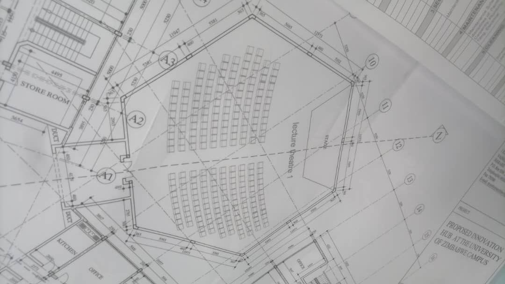

# Q-NEX 客户项目分享

[toc]

# 乌干达学校智慧教室（礼堂）项目

## 项目信息

| Key                 | Value            | Remark |
| ------------------- | ---------------- | ------ |
| 销售人员            | 何凯             |        |
| 项目所在国家        | 乌干达           |        |
| 客户名称            | ICT CONSULTS LTD |        |
| 客户代码            | 00005779         |        |
| 客户公司网站        | ICT CONSULTS LTD |        |
| 是否测试过Q-NEX样机 | 是               |        |
| 需求方名称          | 暂时未告知       |        |
| 售前人员            |                  |        |

### 项目基础信息

| Key              | Value                                                        | Remark                       |
| ---------------- | ------------------------------------------------------------ | ---------------------------- |
| 应用场景         | 学校礼堂                                                     |                              |
| 场景数量         | 1                                                            | 项目涉及的各个场景的数量     |
| 场景大小         | 15m\*12m\*9m                                                 | 各场景的长宽及面积大小（米） |
| 新建还是旧有场景 | 旧有场景                                                     |                              |
| 场景内已有设备   | 一台投影机+固定幕布 8个无源音箱 （6 speakers 30watts and 2 speakers 80watts） |                              |
| 设备联网         | 是                                                           | 是否允许设备接入互联网       |
| 采购方式         | 直接采购                                                     |                              |
| 客户写标         |                                                              | 如果是标案，是否客户写标     |
| 对标产品         |                                                              | 如果是应标，对标产品是哪个   |
| 项目预算（USD）  | 暂时未知                                                     |                              |
| 预计项目交付日期 | 项目落地预计日期：4月10日前 交付日期：待确认                 | 预计项目交付日期             |
| 项目登记日期     | 2023.3.23                                                    |                              |

## 客户需求

乌干达学校智慧教室（礼堂）项目客户需求描述

1. **主席台设置：**
   - 主席台上有一张**6**位座位的桌子，每个座位需配备**1**个鹅颈麦克风。
   - 演讲者在讲话时，需要摄像头自动跟踪演讲者，并录制演讲者的画面、演讲内容和演讲的PPT（如果有）。
   - 麦克风可选择无线麦克风或使用幻象电源的有线麦克风。如果选择无线麦克风，需要配备充电电池和充电器。

2. **录制功能**：
   - 需要同时录制主席台演讲者/教师的声音和画面。
   - 学生区域使用2个手持无线麦克风，当学生站起回答问题时，摄像头需要自动捕捉画面并录制。

3. **文件传屏**：
   - 要求实现老师和学生之间的文件传屏功能。

4. **设备集控和广播/音视频矩阵切换：**
   - 需要实现设备的集中控制，包括广播和音视频矩阵切换。

5. **视频会议和录制：**
   - 需要使用会议软件进行视频会议，并进行录制。

6. **扩展屏幕：**
   - 希望使用小屏幕作为老师电脑的扩展屏幕。

7. **互联网直播：**
   - 需要将录播的画面进行互联网直播，如通过 YouTube 或 Facebook 进行直播。

8. **录播系统设置：**
   - 需要使用2个 PTZ 摄像头作为录播系统的摄像设备。

9. **音频设备：**
   - 需要使用12通道调音台、音频处理器等音频设备。

## 需求分析

1. **麦克风系统选择和控制摄像头**：

   - **麦克风系统选择和控制摄像头**：为实现6个鹅颈麦克风和演讲人画面跟踪效果，建议考虑使用***得胜***的无线或有线会议麦克风系统，并确保其主机支持摄像头跟踪功能。
   - **无线会议麦克风系统要求**：无线会议麦克风系统中，麦克风使用干电池供电，需要配备充电电池和充电器，以确保持续可靠的使用。此外，系统应支持通过**RS485**接口控制摄像头，实现演讲人的画面跟踪效果。
   - **有线会议麦克风系统要求**：有线会议麦克风系统中，麦克风应支持24V幻象电源，以满足正常运行的电力需求。同时，系统应通过**RS422**接口控制摄像头，实现演讲人的画面跟踪效果。

2. **学生区手持麦克风**：在学生区，我们需要使用两个手持麦克风。为方便操作，建议直接使用NMP配备的一拖二无线手持麦克风系统。在下单时，请务必备注需要配备两个手持麦克风。

3. **录播系统配置**：

   1. **演讲区摄像头配置**：为满足演讲区（讲师）的录播需求，建议配置一个可控的PTZ摄像头，用于跟踪讲师的动态位置。这样的摄像头可以通过麦克风系统来定位和控制，以确保讲师的画面始终清晰可见。
   2. **学生区摄像头配置**：对于学生区，建议配置一个自动跟踪的PTZ摄像头，通过学生起立的动作来进行定位。这样的摄像头能够自动调整视角，确保学生区的画面准确捕捉到学生的互动情况。
   3. **麦克风系统与无线手持麦的利用**：考虑到现场已经使用了麦克风系统和无线手持麦克风，因此在配置录播系统时可以不再配备标配的麦克风（请在下单时注意此事项），以避免重复购买和冗余。
   4. **NMP输出与录播主机**：为实现录播功能，建议将NMP的一路HDMI输出连接到录播主机，以作为录播课件画面的来源。通过这种方式，可以确保录播主机能够获取到清晰的课件内容。
   5. **录播系统功能扩展**：除了本地课程录制功能外，录播系统还支持直播推流到Youtube和Facebook等平台。此外，通过配备视频采集卡和会议软件，还可以实现远程在线互动课程，为教育环境提供更多灵活的学习方式。

4. **课堂上传屏功能**：课堂上传屏功能可通过配置IQShare来实现。

5. **设备集控及视频源切换**：

   1. **Q-NEX NMP的搭配**：搭配Q-NEX NMP以实现设备集控和视频源切换的功能。该设备可以实现对多个设备的集中控制和管理，提供便捷的视频源切换功能。
   2. **HDMI输入和输出设备**：在设备配置方面，将HDMI输入设备设置为PC（数位屏）/IQShare，将HDMI输出设备设置为投影机。录播主机需要录制与投影机一致的授课画面，可以通过从NMP接HDMI分配器给投影机和录播主机，以确保在HDMI输入源切换时，投影机和录播主机呈现一致的画面。
   3. **提供可触控的数位屏**：由于投影机不能触控，并且演讲人面向学生而坐，为了方便授课，可以在讲台上为演讲人提供一个可触控的数位屏。该数位屏可以作为PC的扩展屏，将内容输入给投影机展示给学生观看。这样做可以保护演讲人的隐私内容在PC端的显示。
   4. **音频设备配套**：考虑到现场已经有无源音箱设备，并且判断其功率已超出NMP功放的范畴，因此需要配备额外的功放机、调音台、音频处理器等设备，以确保音频输出的质量和适配性。
   5. **设备集控的灵活性**：设备集控系统可以根据现场情况接入灯光、空调、电子门锁等其他设备，实现对整个环境的综合控制，提供更高的灵活性和便利性。

6. **校园音视频广播/直播**：

   - **媒体服务器搭建**：为满足校园音视频广播和直播需求，建议为客户搭建媒体服务器在校园内。该服务器可以用于存储和管理音视频资源，提供稳定的播放和传输服务。

   - **礼堂授课画面直播推流**：如果在将来有需要将礼堂现场的授课画面直播推流到校园内的各个教室，可以进一步建议客户在每个教室配备NMP或MBX设备。这些设备可以接收直播信号，并将其展示在教室内的显示设备上，让学生们可以实时观看授课内容。

## 推荐方案产品

1. 1\*Q-NEX NMP211 + 1\*智能面板CPL10 + 2*手持麦克风（下单备注）标配5号AA干电池（可换充电电池+充电器）
2. 1*Media Server 媒体服务器
3. 1*IQPodium PD150
4. 1*QEKX-306数字音频处理器
5. 1*QAM14 14通道调音台
6. 2*QEKA-403N 4通道功放机，每个功放接4个无源音箱
7. 1\*QDG-U100无线麦克风主机 + 6*QDG-U100T1无线鹅颈麦克风标配5号AA干电池（可换充电电池+充电器）
8. 1\*LCS710录播主机 + 2*CV850 PTZ摄像头（不需要再搭吊顶麦）
9. 1\*IQShare WP40 + 3*IQShare Button
10. 1*HDMI splitter分配器
11. 1*Video Capture视频采集卡
12. （16+16）*可充电电池 + 24仓位充电器，8个麦克风需用到16个充电电池，多备16个充电电池做备用

## 推荐方案拓扑图

### Reference

1. [AM14 模拟调音台](https://www.takstar.com/product/type/3635.html)
2. [AM系列调音台中英文说明书.pdf](https://icn.takstar.com/upload/downloadFile/AM%E7%B3%BB%E5%88%97%E8%B0%83%E9%9F%B3%E5%8F%B0%E4%B8%AD%E8%8B%B1%E6%96%87%E8%AF%B4%E6%98%8E%E4%B9%A6.pdf)

# 阿曼大学多媒体录播教室项目(分组授课)

## 项目信息

| Key                 | Value                        | Remark |
| ------------------- | ---------------------------- | ------ |
| 销售人员            | 何凯                         |        |
| 项目所在国家        | 阿曼                         |        |
| 客户名称            | TECHNOLOGY RESOURCES NETWORK |        |
| 客户代码            | 12676                        |        |
| 客户公司网站        | http://www.trnoman.net/      |        |
| 是否测试过Q-NEX样机 | 否                           |        |
| 需求方名称          | 暂时未告知                   |        |
| 售前人员            |                              |        |

### 项目基础信息

| Key              | Value    | Remark                       |
| ---------------- | -------- | ---------------------------- |
| 应用场景         | 大学教室 |                              |
| 场景数量         | 1        | 项目涉及的各个场景的数量     |
| 场景大小         | 7m*8m    | 各场景的长宽及面积大小（米） |
| 新建还是旧有场景 | 旧有场景 |                              |
| 场景内已有设备   | 详见附件 |                              |
| 设备联网         | 是       | 是否允许设备接入互联网       |
| 采购方式         | 直接采购 |                              |
| 客户写标         |          | 如果是标案，是否客户写标     |
| 对标产品         |          | 如果是应标，对标产品是哪个   |
| 项目预算（USD）  | 暂时未知 |                              |
| 预计项目交付日期 | 待确认   | 预计项目交付日期             |
| 项目登记日期     | 2023.5.8 |                              |

## 客户需求

1. 教学模式为分组教学模式，每个小组6人，每个小组前面的墙上带有一台TV。学生小组讨论后需要将讨论结果发到墙上的TV上。
2. 教师的电脑需要实现对所有学生电脑进行控制，使用现有软件NetSupport。
3. 需要将教学的内容录制下来，包括教师摄像头和学生摄像头。摄像头需要具备自动跟踪功能。已演示了LCS710PRO（CV870摄像头），客户表示可以接受。
4. 目前手头该方案需要的是同时录制教师和学生的音视频内容，非静音状态。
5. 目前教师已配备Lumens的录播系统EC-1000、一台投影机和六台电视。客户希望我们的方案能与现有方案结合，也可以提出新方案，例如将投影机更换为液晶显示器。
6. 天花板带有麦克风用作收声，共有4个天花板麦克风，其中一个用于教师，三个用于学生。
7. Q-NEX需要控制的设备包括电脑、投影机、Podium、展台、空调、灯以及音视频的推流和直播到其他教室。

其他要点：客户是普米的国家总代，对于测试Q-NEX和HA样机很感兴趣。然而，希望在最终确定方案时与手头项目一起进行。目前已有我司的HC、摄像头和WP40传屏方案。

## 需求分析

客户的主要需求为分组教学，可采用快立享（Quickshare）的方案，详细如下：
1. **要点描述：**

  - 在每台TV上连接一个传屏盒子，这样学生可以使用有线或无线的方式将各自电脑的画面投屏至TV上。
  - 对于老师端的电脑或液晶大屏的OPS，安装快立享软件，该软件具备多种授课模式的切换功能。老师可以根据需要选择不同的模式，如老师授课模式、分组讨论模式、集中展示模式等。
  - 传屏盒子支持RS232串码控制，并连接到NMP上。这样，老师可以通过智能面板进行开关机和切换模式等操作。通过智能面板的简单操作，老师能够轻松控制投屏盒子和相关设备的功能。

  **授课模式的描述:** 

  - ***老师授课模式***：所有TV显示老师的电脑画面。这种模式下，学生可以通过TV观看老师演示的内容。
  - ***分组讨论模式***：支持各小组内学生将自己的电脑画面投屏至TV进行内部讨论。该模式支持4分屏或最多9分屏的画面，方便小组间的交流和合作。
  - ***集中展示模式***：该模式下，老师可以通过软件或智能面板将某个TV的画面拉至老师大屏上进行展示。同时，也可以选择同时展示4个小组或最多9个小组的TV画面，以实现集中展示和比较分析的功能。

2. 课程录制和直播通过搭建常态化直录播系统LCS710 Pro实现。支持通过智能面板一键开关机和一键开关录制课程；

3. 客户现有设备，如投影机，可以通过CBX连接至NMP进行一键开关；支持现有麦克风系统音频输入至NMP，通过NMP输出至音箱；

4. 设备集控及视频源切换等可通过搭配Q-NEX NMP。hdmi输入设备为PC（数位屏）/IQView，hdmi输出设备为投影机，由于投影机不能触控，且演讲人面向学生而坐，为方便授课，可为演讲人提供一个可触控的数位屏在讲台上，数位屏作为PC的扩展屏输入给投影机展现给学生观看，从而保护演讲人的隐私内容在PC端；
    灯控、门锁控制和空调控制也支持通过智能面板一键控制，具体连接方式需了解教室现有设备情况；

5. NMP内置无线麦模块，老师用领夹麦，学生用手持麦，同时NMP内置功放系统，支持连接一对无源音箱（最多2对）输出音频。

6. 保留客户原有集控软件Netsupport。

## 推荐方案产品

1. 1*Q-NEX NMP211-G + 智能面板
2. 1*IQVideo LCS710 Pro
3. 1*IQView E4521
4. 1*IQPodium PD150
5. 1*IQSound PS610 (2只)
6. 5*QuickShare Box（含软件）

## 推荐方案拓扑图

# 津巴布韦大学礼堂项目

## 项目信息

| 销售人员     | 吴琳滢                                             | 项目所在国家        | 津巴布韦 | 客户名称   | TOUCHBASE TECHNOLOGIES | 客户代码 | 00039987 |
| ------------ | -------------------------------------------------- | ------------------- | -------- | ---------- | ---------------------- | -------- | -------- |
| 客户公司网站 | [www.touchbase.co.zw](http://www.touchbase.co.zw/) | 是否测试过Q-NEX样机 | 否       | 需求方名称 | 暂时未告知             | 售前人员 | 许剑锋   |

### 项目基础信息

| 应用场景                             | 学校礼堂                                                     | 项目涉及的各个场景的数量 | 1        | 各场景的长宽及面积大小（米） | 长：30m  | 新建还是旧有场景         | 旧有场景  |
| ------------------------------------ | ------------------------------------------------------------ | ------------------------ | -------- | ---------------------------- | -------- | ------------------------ | --------- |
| 如果是旧有场景，场景内已有设备有哪些 | 3台epson投影机+2个升降幕布（45W/个左右）+1个固定幕布（中间），DSPP音频系统，     4个无源音箱+功放 | 是否允许设备接入互联网   | 是       | 标案还是直接采购             | 直接采购 | 如果是标案，是否客户写标 |           |
| 如果是应标，对标产品是哪个           |                                                              | 项目预算（USD）          | 暂时未知 | 预计项目交付日期             | 待确认   | 项目登记日期             | 2023.1.23 |

## 客户需求

请具体填写客户希望实现的功能：
1. 支持任何位置的无线投屏
2. 主席台上有一张六位座位的桌子+1个演讲者（共7席），每个座位需有1台显示器同步投影画面+1个有线鹅颈麦克风，标配的2个无线麦给台下观众使用（原本要4个，已说服客户2个）
3. 当有人投影时，幕布自动放下。
4. 放置4个powerful摄像头，可以zoom&teams开会
5. 将会议现场进行校园广播&社交平台直播
6. 总控室在入口处，NMP放在礼堂的桌子下（可调整）
7. 所有设备都要连接到NMP
8. 其他：其他教室里有2台TV要放他们的project progress，已推荐MBX
9. 7座位演讲区（讲师）配3个PTZ摄像头，学生区配1个PTZ摄像头

## 需求分析

1. 无线传屏功能可通过IQShare来实现。
2. 7个鹅颈麦克风，考虑使用得胜的有线会议麦克风系统（麦克风支持24V幻象电源），配备音频处理器和调音台，通过NMP将声音输出到功放再到礼堂的音箱；
3. 学生区使用2个手持麦克风，可直接用NMP配的一拖二无线手持麦，下单时需备注配2个手持麦。
4. 录播系统：配置LCS910系统+4个PTZ摄像头，通过人员在录播主机前手动导播；因现场已使用麦克风系统及无线手持麦，可不用再配录播系统的标配麦（下单时需注意）；
NMP一路hdmi out给录播主机，作为录播的课件画面。录播系统除了本地课程录制外，还能支持直播推流到Youtube/Facebook，同时通过视频采集卡输出给笔记本电脑，配合会议软件，亦可实现远程在线互动课程。
5. 设备集控及视频源切换等可通过搭配Q-NEX NMP。
由于投影机不能触控，且演讲人面向学生而坐，为方便授课，可为演讲人提供一个可触控的数位屏在讲台上，数位屏作为PC的扩展屏输入给投影机展现给学生观看，从而保护演讲人的隐私内容在PC端。
NMP的hdmi输入设备为PC（数位屏）/IQShare，hdmi输出设备为投影机（录播主机需录制与投影机一致的授课画面，可通过从NMP接HDMI分配器给投影机（另外2台投影机通过VGA线与第1台投影机同步画面）和录播主机，保证hdmi输入源切换时，投影机和录播主机呈现一致的画面；另外6台数位屏同理，需配置1分10的HDMI分配器）。
另外，现场已经有音频设备（无源音箱和功放），可以从NMP获取声源。
设备集控可根据现场情况接入电动幕布，灯，空调，电子门锁等设备，2台电动幕布可以并联接到NMP与投影机联动上升/下降。
6. 校园音视频广播/直播需求，可为客户在校园内搭建媒体服务器，如后期有需要将礼堂现场的授课画面直播推流到校园内的各个教室，则可以再建议客户在每个教室搭配NMP或MBX设备。

## 推荐方案产品

1. 流媒体服务软件（有让客户自己准备MS）
2. 1*Q-NEX NMP211 + 1*智能面板CPL10 + 无线麦克风2
3. 7*IQPodium PD150（方案图里推荐3个，但客户想要7个，他说自己能找到powerful的HDMI分配器）
4. 1*QEKX-306数字音频处理器
5. 1*QAM14 14通道调音台
6. 有线鹅颈麦QDG-S200（1主机+7麦）
7. 1*LCS910录播主机 +4个无线摄像头（麦应该不需要）
8. 1*IQShare WP40 + IQShare Button（个数待确认，先按8个给）
9. 1* HDMI splitter分配器（客户说自己能找到powerful的HDMI分配器）
10. 1*Video Capture视频采集卡

## 推荐方案拓扑图

## 场地图

 

# 哥斯达黎加学校智慧教室项目

## 项目信息

| 销售人员     | 张金                                  | 项目所在国家        | 哥斯达黎加 | 客户名称   | TECNOLOGIA EDUCATIVA TE, SA | 客户代码 | 00005404 |
| ------------ | ------------------------------------- | ------------------- | ---------- | ---------- | --------------------------- | -------- | -------- |
| 客户公司网站 | http://www.tecnologiaeducativa.co.cr/ | 是否测试过Q-NEX样机 | 否         | 需求方名称 | UNIVERSIDAD  ULACIT         | 售前人员 | 许剑锋   |

### 项目基础信息

| 应用场景                             | 教室     | 项目涉及的各个场景的数量 | 1    | 各场景的长宽及面积大小（米） | 48平米 | 新建还是旧有场景         | 旧有场景 |
| ------------------------------------ | -------- | ------------------------ | ---- | ---------------------------- | ------ | ------------------------ | -------- |
| 如果是旧有场景，场景内已有设备有哪些 | 灯和空调 | 是否允许设备接入互联网   | 允许 | 标案还是直接采购             | 直采   | 如果是标案，是否客户写标 |          |
| 如果是应标，对标产品是哪个           |          | 项目预算（USD）          |      | 预计项目交付日期             |        | 项目登记日期             | 2023/5/5 |

## 客户需求

 

## 需求分析

从客户提供的拓扑图分析，客户需要的设备有：液晶大屏、领夹麦、音箱、跟踪PTZ摄像头、鹅颈麦
1. 学生区鹅颈麦克风考虑使用得胜的无线会议麦克风系统或是有线会议麦克风系统，其主机支持摄像头跟踪演讲人。无线会议麦克风系统中麦克风使用干电池，需配充电电池和充电器，通过RS485接口控制摄像头可实现演讲人画面跟踪的效果，最多支持连接83个鹅颈麦；如果需要有线会议麦克风系统的麦克风，其支持24V幻象电源，通过RS422接口控制摄像头。
2. 老师使用领夹麦克风，可直接用NMP配的一拖二无线麦。
3. 录播系统：老师配1个PTZ摄像头，跟踪可通过摄像头本身的算法来跟踪老师左右移动及板书书写；学生区配1个PTZ自动跟踪摄像头，通过无线麦克风系统的RS485接口控制摄像头可实现学生画面跟踪的效果；因现场已使用麦克风系统及无线手持麦，可不用再配录播系统的标配麦（下单时需注意）；NMP一路hdmi out给录播主机，作为录播的课件画面。录播系统除了本地课程录制外，还能支持直播推流到Youtube/Facebook，同时通过视频采集卡，配合会议软件，亦可实现远程在线互动课程。
4. 设备集控及视频源切换等可通过搭配Q-NEX NMP。hdmi输入设备为PC（数位屏）/IQShare/展台，hdmi输出设备为液晶HA1100 PRO（录播主机需录制与液晶一致的授课画面，可通过从NMP接HDMI分配器给投影机和录播主机，保证hdmi输入源切换时，投影机和录播主机呈现一致的画面），为方便授课及保护老师电脑隐私，为老师提供一个可触控的数位屏在讲台上，数位屏作为PC的扩展屏输入给投影机展现给学生观看，从而保护演讲人的隐私内容在PC端。配备无源音箱可直接连接NMP输出声音，设备集控可根据现场情况接入灯，空调，电子门锁等设备。
5. 校园音视频广播/直播需求，可为客户在校园内搭建媒体服务器，如后期有需要将礼堂现场的授课画面直播推流到校园内的各个教室，则可以再建议客户在每个教室搭配NMP或MBX设备。

## 推荐方案产品

1. 1*Q-NEX NMP211-G + 1*智能面板
2. 1*IQVideo LCS710 PRO 直录播系统
3. 1*86"IQTouch HA1100 Pro 液晶
4. 2*IQSound PS610 无源音箱
5. 1*Wireless Microphone System QDG-U100无线麦克风系统+ N*QDG-U100T1无线鹅颈麦克风标配5号AA干电池（可换充电电池+充电器），鹅颈麦数量取决于学生数量
6. 1*Digital Audio Processor QEKX-306 数字音频处理器
7. 1*Mixer Console QAM14 调音台
8. 1*IQPodium PD150 数位屏
9. 1*IQShare WP40 + N*IQShare dongles 无线传屏系统
10. 1* HDMI splitter 分配器
11. 1*Video Capture 视频采集卡
    12.（16+16）* 可充电电池 + 24仓位充电器，8个麦克风需用到16个充电电池，多备16个充电电池做备用

待确认事项：
1.学生数量（鹅颈麦数量和投屏器数量）
2.教室长宽（考虑录播摄像头的拍摄范围）
3.空调类型（NMP不支持控制中央空调）

## 推荐方案拓扑图

# XX项目

## 项目信息

### 项目基础信息

## 客户需求

## 需求分析

## 推荐方案产品

## 推荐方案拓扑图

# Reference

1. [smb://192.168.10.168/IQ-国际事业部/6.小奇智联项目部/1.部门共享/3.业务报备项目](smb://192.168.10.168/IQ-国际事业部/6.小奇智联项目部/1.部门共享/3.业务报备项目)
2. smb://192.168.10.168/IQ-国际事业部/4.跨部门共享区/1.售前支持Pre-sales/2. 营销工具（彩页&参数表&图片&视频等）Marketing materials/9.Q-NEX产品线/05 Case study
3. smb://192.168.10.168/IQ-国际事业部/6.小奇智联项目部/1.部门共享/2.一些售前资料/Q-NEX售前资料/1.Q-NEX在营项目分享
4. ~~smb://192.168.10.168/IQ-国际事业部/4.跨部门共享区/1.售前支持/2. 营销工具（彩页&参数表&图片&视频等）/Q-NEX/13 案例分析~~
