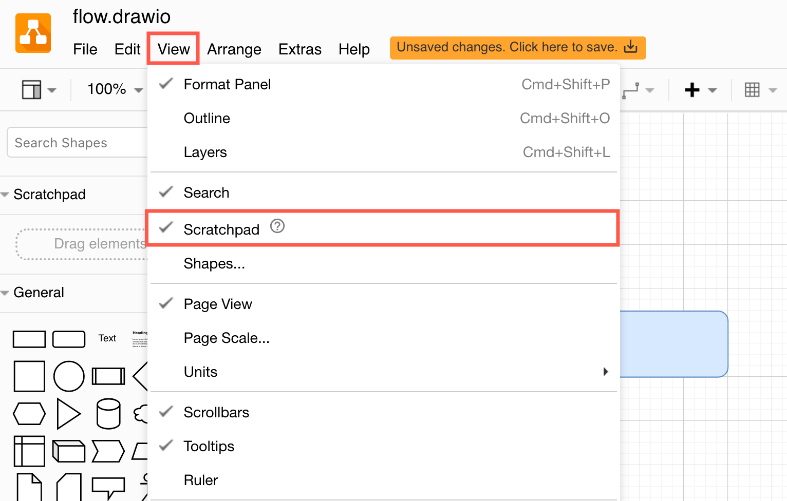
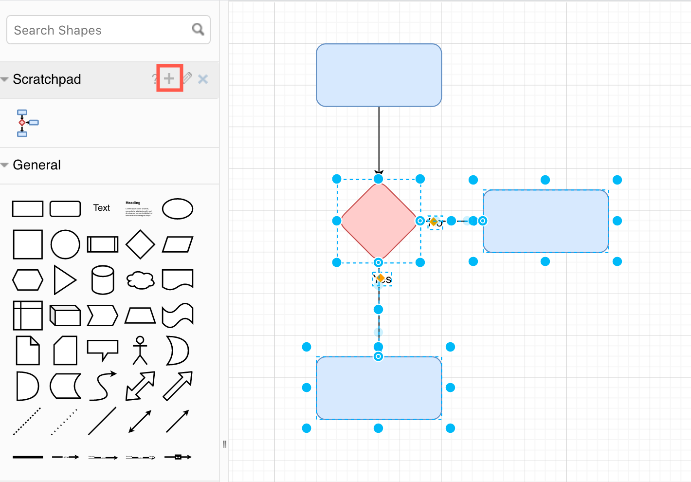
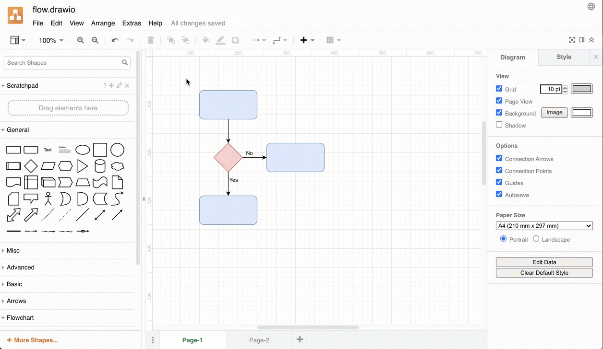
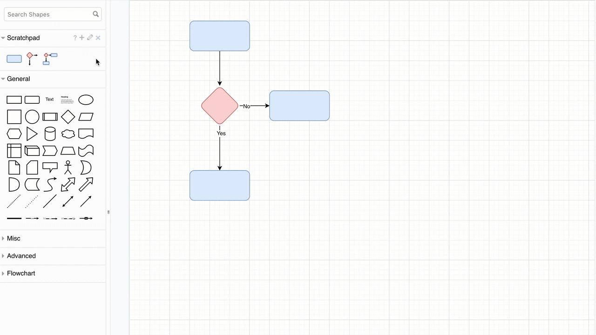
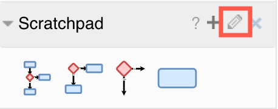
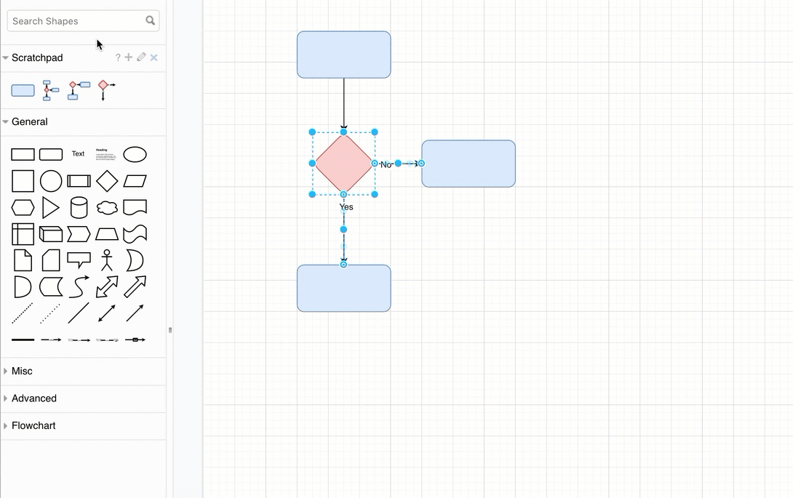
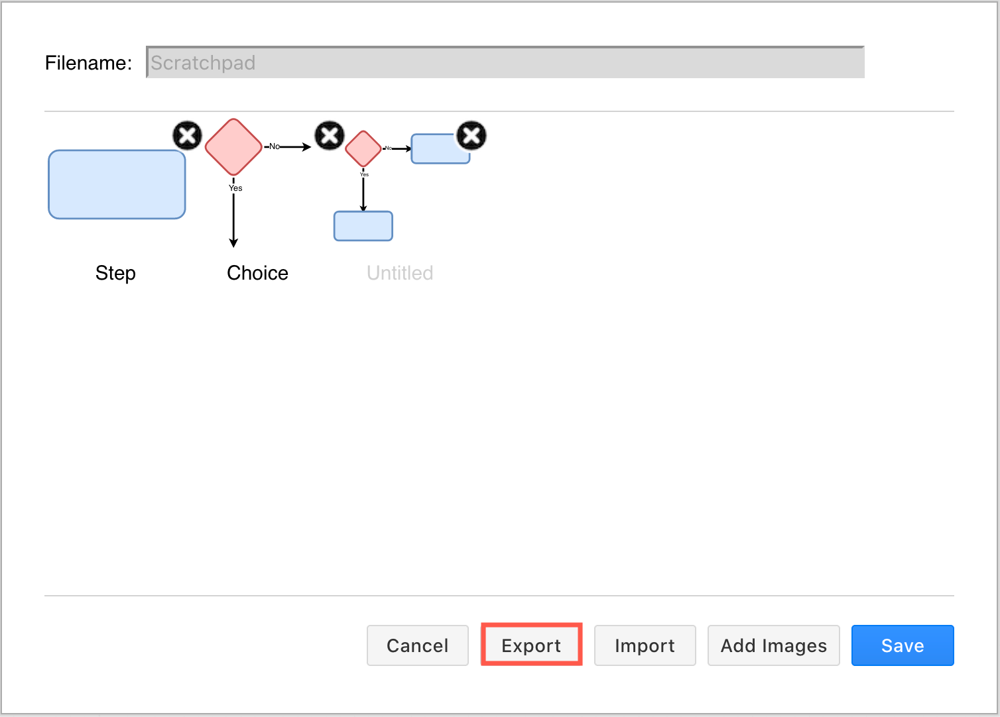
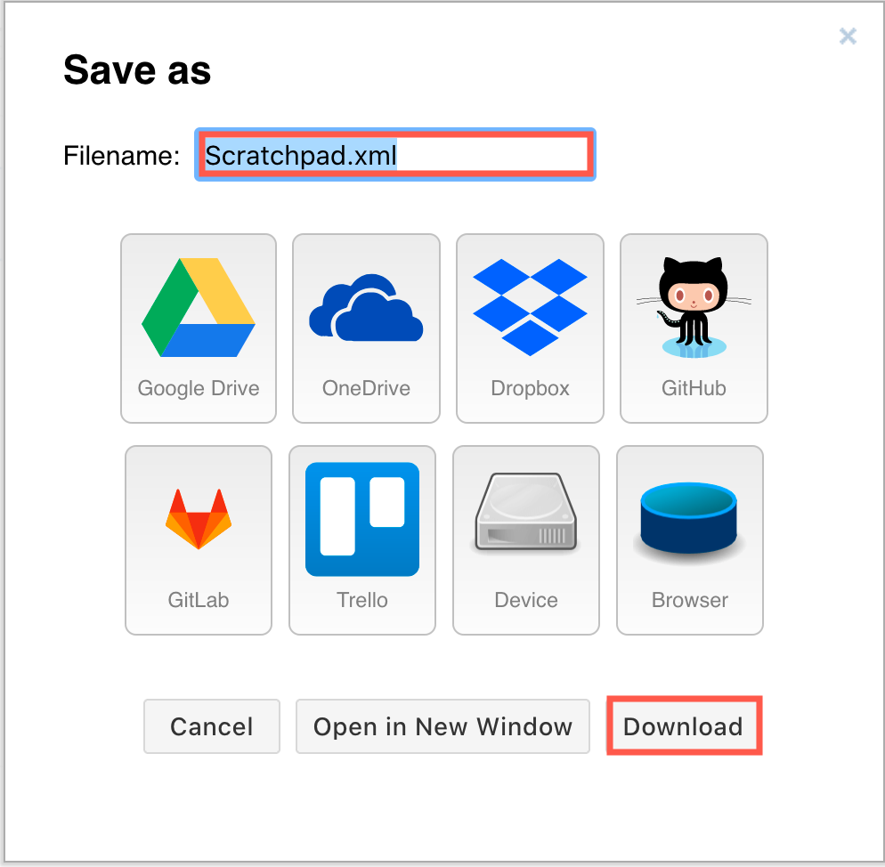

# Use the scratchpad in draw.io

[toc]

The scratchpad is your personal shape library where you can add the styled shapes or groups of shapes that you use the most often. You can drag a shape/group of shapes from the drawing canvas onto your scratchpad, and then drag new copies from the scratchpad back onto the drawing canvas whenever you need them.

**Display the scratchpad**

The scratchpad is usually found at the top of the left panel, above the shape libraries and below the *Search Shapes* field.

- Select *View > Scratchpad* to display or hide the scratchpad.

 Scratchpad to display or hide the scratchpad" />

[See how to get started with the draw.io editor](https://www.drawio.com/doc/getting-started-editor.html)

## Add shapes to the scratchpad

- [Select one or more shapes](https://www.drawio.com/doc/faq/select-multiple-shapes.html), then drag them from the drawing canvas and drop them onto the scratchpad.
- Alternatively, once you have selected the shapes, click on the little *+* (plus) icon in the heading of the Scratchpad library to add the shapes.

## Add shapes from the scratchpad to the drawing canvas

Click on one of the shapes or groups of shapes you have saved to the scratchpad to add another copy to the drawing canvas.

Drag the shapes from the scratchpad. You can connect this to an existing shape on the drawing canvas by hovering over the target shape and then dropping it on one of the direction arrows that appear.

## Edit the shapes on the scratchpad

Click the edit pencil icon to open the scratchpad ‘library’ and edit the shapes you have stored there.

- Click and drag shapes into new positions in the scratchpad.
- Click on the small cross in the top-right of a shape to delete it from the scratchpad.
- Click on the text field underneath a shape and enter a name. By default, shapes added to the scratchpad are untitled.

Click *Save* when you have finished editing the scratchpad to return to the drawing canvas.

## Export the scratchpad as a custom shape library

1. Click the edit pencil to edit the scratchpad, then click *Export*.
   
2. Enter a filename - your custom shape library will be saved with the `.xml` file extension by default - then click *Download*, or click on the location where you want to save the file.
   

[See how to open and use custom libraries in draw.io](https://www.drawio.com/blog/custom-libraries.html)