# 售前产品清单参考

[toc]

## Q-NEX

| 产品名称         | Category             | Picture                                                      | Dimension                                                    | Weight     | Remark                                                       |
| ---------------- | -------------------- | ------------------------------------------------------------ | ------------------------------------------------------------ | ---------- | ------------------------------------------------------------ |
| NMP211           |                      | 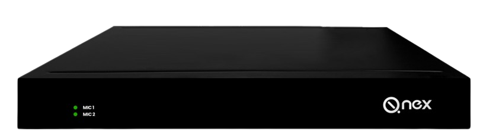 |                                                              |            | 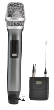 |
| CPL20            |                      | 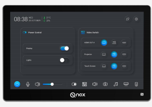 |                                                              |            |                                                              |
| NDP500           | Q-NEX Digital Podium |                                                              |                                                              |            |                                                              |
| [NDP500 GEN 2.1] | Q-NEX Digital Podium |  |                                                              |            |                                                              |
| NDP500桌子       |                      | 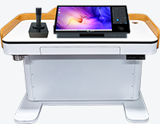 | 1200x600mm  Floor stand Electronic Stand support height adjustment 1240mm (L) x 620mm (W) x 900mm (H)  (Stand) |            |                                                              |
| ND100            |                      | 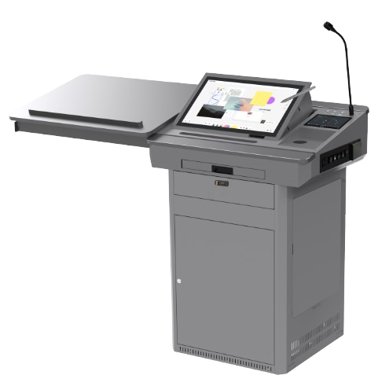 | 2162(L) x 609(W) x 1212(H)                                   | 96kgs      |  |
| PS410            |                      |  | 284/*215/*189mm                                              | 3.8kg each |                                                              |
| CBX200           |                      |  |                                                              |            | 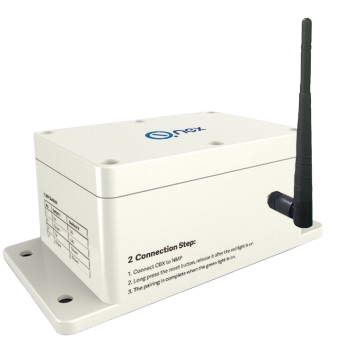 |

### Q-NEX 周边

| 产品名称                | Category | Picture                                                      | Dimension | Weight | Remark |
| ----------------------- | -------- | ------------------------------------------------------------ | --------- | ------ | ------ |
| OPS                     |          | 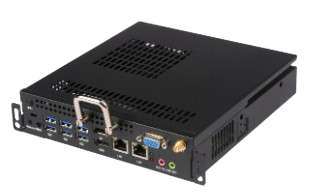      |           |        |        |
| [E4521]                 |          |  |           |        |        |
| [E4520]                 |          | 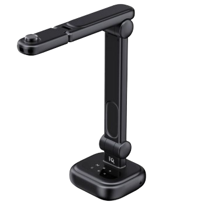 |           |        |        |
| 空调                    |          |        |           |        |        |
| 灯带                    |          | 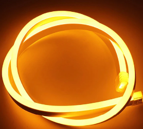 |           |        |        |
| Web-console             |          |  |           |        |        |
| Q-NEX APP (Android&IOS) |          |  |           |        |        |
|                         |          |                                                              |           |        |        |

## LCS710 

| 产品名称               | Category | Picture                                                      | Dimension | Weight | Remark                                                       |
| ---------------------- | -------- | ------------------------------------------------------------ | --------- | ------ | ------------------------------------------------------------ |
| LCS710                 | IQ-LCS   | 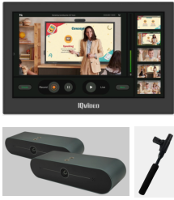 |           |        |                                                              |
| Video Station  x 1     |          |  |           |        | 支持AI摄像头； 不支持录播互动                           |
| CV210 (ePTZ) x 2       |          |  |           |        | 唯二带跟踪的摄像头，LCS710套餐下ePTZ,； 能跟踪学生且放大 |
| S201 (Ceiling Mic) x 2 |          |                                                              |           |        |                                                              |

## LCS710 Pro

| 产品名称 | Category    | Picture                                                      | Dimension | Weight | Remark                                                       |
| -------- | ----------- | ------------------------------------------------------------ | --------- | ------ | ------------------------------------------------------------ |
|          |             |                                                              |           |        |                                                              |
| S610 x2  | Ceiling Mic |    |           |        |  接LC710主机的MIC IN1(推荐)或者LINE IN 1 |
| S610M x1 | Sound Mixer |  |           |        | 只能和S610搭配，不能和S210/A100搭配                          |

## LCS810

| 产品名称               | Category    | Picture                                                      | Dimension （mm)                               | Weight | Remark                                                       |
| ---------------------- | ----------- | ------------------------------------------------------------ | -------------------------------------------------- | ------ | ------------------------------------------------------------ |
| [LCS810]               | IQ-LCS[^1]  |             | 369.43(W) x 235.59(H) x38.00(D) peg board[^2] | 3kgs   |                                                              |
| CV870 Pro x2           |             |  | 245×145×165  Peg Board                        |        | 学生：双目 老师：双目  唯二带跟踪的摄像头，LCS710套餐下ePTZ 能跟踪学生且放大 |
| CV210 (ePTZ) x 2       |             |  |                                                    |        | 唯二带跟踪的摄像头，LCS710套餐下ePTZ,； 能跟踪学生且放大 |
| S610 x2                | Ceiling Mic |    | S610接入主机的MIC IN 1                             |        |  |
| S610M x1               | Sound Mixer |   |                                                    |        | 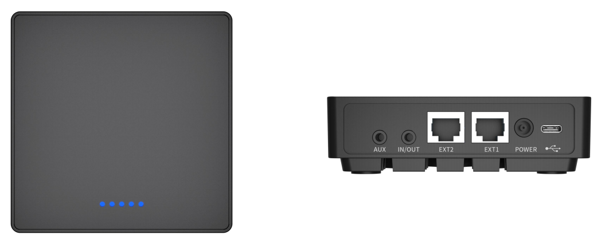 只能和S610搭配，不能和S210搭配 |
| [S210] x 2 (A100) | Ceiling Mic |  | A100接入主机的凤凰口                               |        |  |

[^1]:录播互动： 710不带互动，810才有互动；所谓互动就是学生在另一个教室（远程），进行提问等与教师互动，教室可以实时收到并给出反馈，这个互动主要是由主机决定。（2025-03-31，庆文）
[^2]: "Peg board" 指的是一种用于展示或挂载物品的“穿孔板”或“挂钩板”。

## IQMeet

| 产品名称                                                     | Category                        | Picture                                                      | Dimension                       | Weight | Remark                                                       |
| ------------------------------------------------------------ | ------------------------------- | ------------------------------------------------------------ | ------------------------------- | ------ | ------------------------------------------------------------ |
| NPS                                                          |                                 | 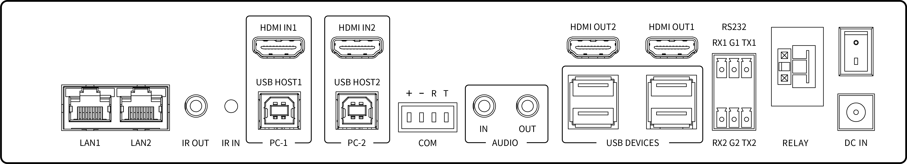 | 279 x 231 x50 mm                |        |               |
| NPS-CPL20                                                    |                                 | 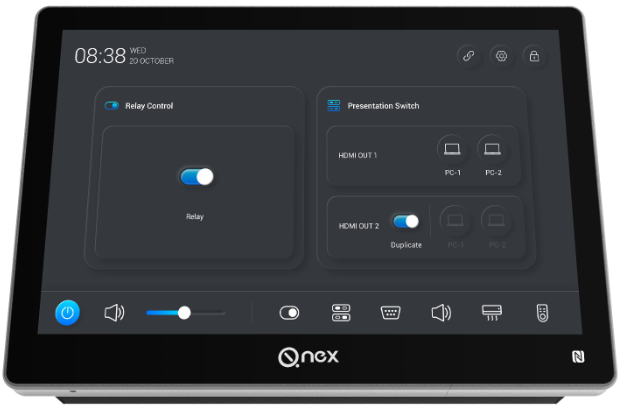 |                                 |        |                                                              |
| [会议门牌:CPL50]|                                 | 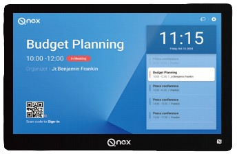  |                                 |        |                                                              |
|                                                              |                                 |                                                              |                                 |        |                                                              |
|                                                              |                                 |                                                              |                                 |        |                                                              |
| [S350]| IQ Meeting Speakerphone         |  |                                 |        |                                                              |
| [CV810 GEN2]| IQMeet Audio Video Conferencing |  | 181mm (L) × 115mm(W) × 149mm(H) |        |    支持PoE |
| SA200                                                        |                                 |              |                                 |        |                                                              |
| AVS200                                                       |                                 | 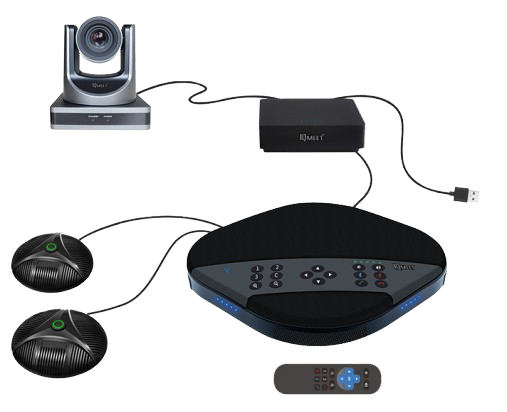             |                                 |        |                                                              |
| [HY200]| IQMeet                          | 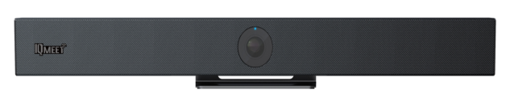 |                                 |        |                                                              |
| [AHY500]| IQShare                         | 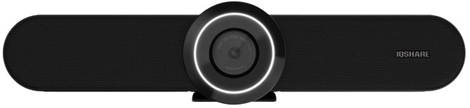 | 90mm x 90mm x 18mm(宽有误)      |        |  |

### 得胜

| 产品名称                                                     | Category | Picture                                                      | Dimension | Weight | Remark          |
| ------------------------------------------------------------ | -------- | ------------------------------------------------------------ | --------- | ------ | --------------- |
| [德胜 DG-U100无线麦克风系统](https://www.takstar.com/product/type/3677.html ) |          |  |           |        | 最远能 60-70 米 |
| [官网](https://www.takstar.com/product/type/3677.html)       |          |    |           |        |                 |
| [官网](https://www.takstar.com/product/type/3677.html)       |          |     |           |        |                 |
| ?功放                                                        |          |  |           |        |                 |
| [EKA-403N 四通道专业功放 ](https://www.takstar.com/product/type/3539.html) |          |  |           |        |                 |
| [EKL-121 专业音箱](https://www.takstar.com/product/type/3574.html) |          |  |           |        |                 |
| [Mixing Console-EM10](https://www.takstar.com/product/type/3985.html) [AM10](https://www.takstar.com/product/type/3634.html) |          |  |           |        |                 |
| [音频处理器EKX-306](https://www.takstar.com/product/type/3325.html) |          |            |           |        |                 |
| [FE-224N 抑制器](https://www.takstar.com/product/type/3763.html) FE-224N-Digital Feedback Suppressor |          | 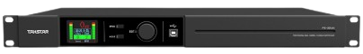 |           |        |                 |

## IQShare

| 产品名称                                                     | Category  | Picture                                                      | Dimension                                                    | Weight | Remark |
| ------------------------------------------------------------ | --------- | ------------------------------------------------------------ | ------------------------------------------------------------ | ------ | ------ |
| [IQMatrix] | IQ Share  | 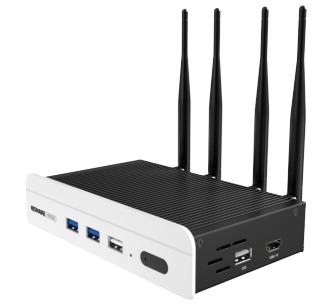 |  |        |        |
| [PD150] | IQ Podium |   | 524(L) x 315(H) x 48(D)                                      |        |        |
| [IQShare WP40]|           | 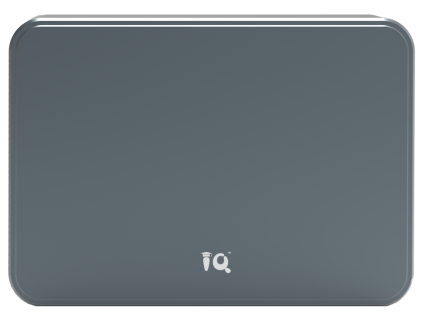 |                                                              |        |        |
| Dongle                                                       |           |  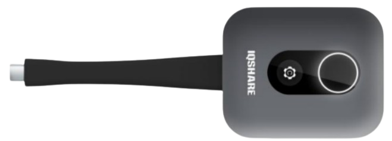 | H5 C5(可组合)                                           |        |        |
|                                                              |           |                                                              |                                                              |        |        |

## IQ Touch

| 产品名称                                    | Category        | Picture                                                      | Dimension                                                    | Weight      | Remark     |
| ------------------------------------------- | --------------- | ------------------------------------------------------------ | ------------------------------------------------------------ | ----------- | ---------- |
| [IQTouch]                                   |                 |                                                              |                                                              |             |            |
| [135" All-in-one LED LE135N2]               | LED All-in-one  |  | 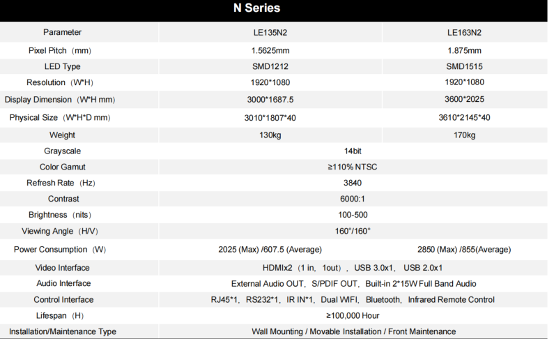 |             | 不支持触控 |
| [IQBoard MEMO]                              | IQ Board        |  |                                                              |             |            |
| IQBoard MemoLE60P                           |                 |  | 1290(W)x1028(H)x28(D)                                        | 71KG        |            |
| [QA1300 PRO]                                | IQTouch -IFP    | 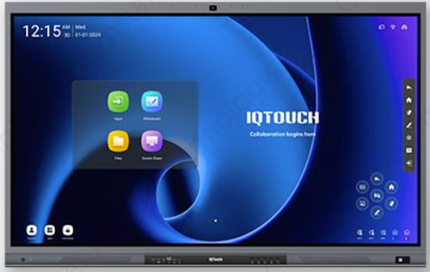 | 1723 x 1055x116mm（75 inch, 400W)                            | 10kgs (75 ) |            |
| [HA1100 Pro]                                | IQTouch -IFP    | 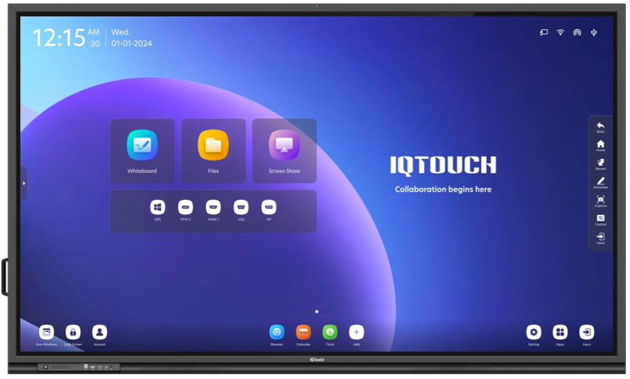 |                                                              |             |            |
| AI Smart Blackboard **IQTouch B86002** | IQTouch         | 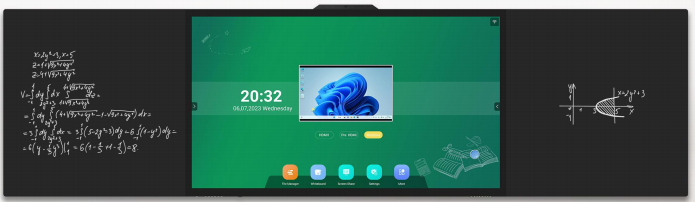 | 4200×1183.8×114.45mm 86"                                | 94.5KGS     |            |
| **Wall Mount DS** SW1 [Win猛击这里]    | Digital Signage | 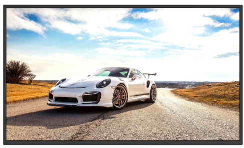 | 1. **43inch SW1 Lite** :  957 x 557 x 94 / ? kg  2. **55inch SW1 Lite**: 1226x709x74mm / 11kg  3. **55inch SW1 Basic**: 1225.8 x 699.2 x 63.4 / 15.2kg |             |            |
| Floor stand DS SF1 PRO                      | Digital Signage |  | LWH:578 x 1800 x 30.5                                        | 55kgs       |            |
| [Digital Poster-R (Win)                     | LED-all-in-one  |  | 600 x 2025 x 35 (mm)                                         | 37kg        |            |

### 16:9 屏幕尺寸换算表（单位：米）

| 尺寸（英寸） | 宽（W） | 高（H） | 对角线（D） |
| ------------ | ------- | ------- | ----------- |
| 65 inch      | 1.43 m  | 0.80 m  | 1.65 m      |
| 75 inch      | 1.66 m  | 0.93 m  | 1.90 m      |
| 86 inch      | 1.90 m  | 1.07 m  | 2.18 m      |
| 98 inch      | 2.17 m  | 1.22 m  | 2.49 m      |
| 110 inch     | 2.43 m  | 1.37 m  | 2.79 m      |

✅ **备注**：

- 以上为屏幕可视区域的标准值，不包含边框（bezel）
- 若是超窄边框，整机尺寸与屏幕相差不大；若边框宽，需要额外加上每侧几厘米
