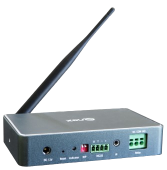
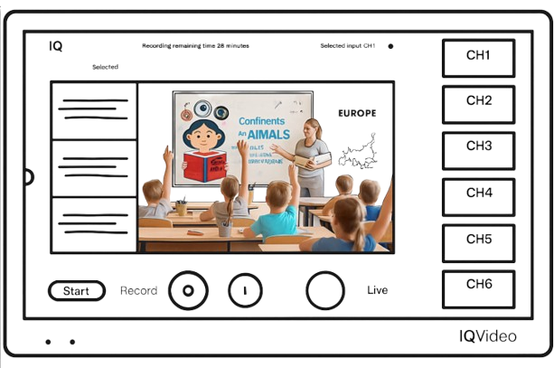
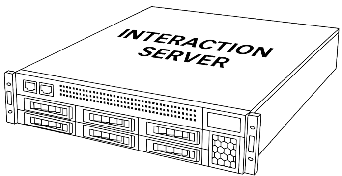
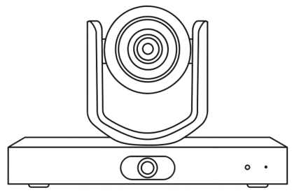
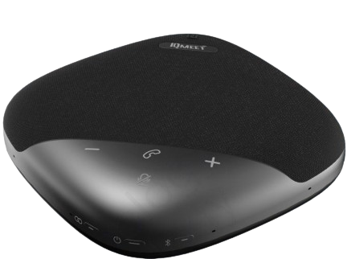

# 售前产品清单参考

[toc]

1. 使用一根网线接入NDP500, 通电；再使用Q-NEX云端平台（Dashabord）观察是否在线（如果现场没有网络，也可以使用Configtool获取到IP）
2. 在10寸屏上输入步骤1获取到的IP
3. 分别接入输入设备（如笔记本，Document Camera）和输出设备（显示设备接入NDP500的 HDMI OUT A/B 口）进行矩阵切换操作看下是否正常

## Q-NEX

| 产品名称                                                     | Category                                                     | Picture                                                      | Dimension                                                    | Weight                                                       | Remark                                                       |
| ------------------------------------------------------------ | ------------------------------------------------------------ | ------------------------------------------------------------ | ------------------------------------------------------------ | ------------------------------------------------------------ | ------------------------------------------------------------ |
| NMP211 [Win猛击这里](Z:/4.跨部门共享区/1.售前支持Pre-sales/2. 营销工具（彩页&参数表&图片&视频等）Marketing materials/9.Q-NEX产品线/01 Brochure&Datasheet&Manuals/1. NMP-G/NMP211-G-L2U) |                                                              |  |  |                                                              |                                                              |
|                                                              |  |  |  |  |  |
| CPL20                                                        |                                                              |  |  |                                                              |                                                              |
| [NDP600-Win](Z:/4.跨部门共享区/1.售前支持Pre-sales/2. 营销工具（彩页&参数表&图片&视频等）Marketing materials/9.Q-NEX产品线/01 Brochure&Datasheet&Manuals/10. Digital Podium/NDP600) | Q-NEX Digital Podium                                         |  |  |                                                              |                                                              |
| NDP500桌子                                                   |  |  |                                                              |                                                              | 1200x600mm  Floor stand Electronic Stand support height adjustment 1240mm (L) x 620mm (W) x 900mm (H)  (Stand) |
| NDP500桌子不带麦克风                                         |  **5.11.AX 99.00003** |  |  |  |                                                              |
|                                                              |  |  |                                                              |                                                              |                                                              |
| [ND100-Mac](smb://192.168.10.168/IQ-国际事业部/4.跨部门共享区/1.售前支持Pre-sales/2. 营销工具（彩页&参数表&图片&视频等）Marketing materials/9.Q-NEX产品线/01 Brochure&Datasheet&Manuals/10. Digital Podium (NDP100 & NDP500)/NDP100) [Win猛击这里](z:/4.跨部门共享区/1.售前支持Pre-sales/2. 营销工具（彩页&参数表&图片&视频等）Marketing materials/9.Q-NEX产品线/01 Brochure&Datasheet&Manuals/10. Digital Podium (NDP100 & NDP500)/NDP100) |  |  | 2162(L) x 609(W) x 1212(H)                                   | 96kgs                                                        |  |
| NDP100                                                       |  |  |  **5.11.AX 99.00003** |                                                              |                                                              |
| [PS410-Mac](smb://192.168.10.168/IQ-国际事业部/4.跨部门共享区/1.售前支持Pre-sales/2. 营销工具（彩页&参数表&图片&视频等）Marketing materials/9.Q-NEX产品线/01 Brochure&Datasheet&Manuals/5. IQSound Passive Speaker) [Win猛击这里](z:/4.跨部门共享区/1.售前支持Pre-sales/2. 营销工具（彩页&参数表&图片&视频等）Marketing materials/9.Q-NEX产品线/01 Brochure&Datasheet&Manuals/5. IQSound Passive Speaker) |                                                              |  284 x 215 x 189mm |  |  | 3.8kg each                                                   |
| CBX200 [CBX200-Win](Z:/4.跨部门共享区/1.售前支持Pre-sales/2. 营销工具（彩页&参数表&图片&视频等）Marketing materials/9.Q-NEX产品线/01 Brochure&Datasheet&Manuals/7.Control Box) |                                                              |  |   |                                                              |  |

 

### 周边配件

| 产品名称                                                     | Category | Picture                                                      | Dimension                                                    | Weight                                                       | Remark |
| ------------------------------------------------------------ | -------- | ------------------------------------------------------------ | ------------------------------------------------------------ | ------------------------------------------------------------ | ------ |
| OPS                                                          |          |       |   |                                                              |        |
| Router                                                       |          |  |  |                                                              |        |
| [E4521](Z:/4.跨部门共享区/1.售前支持Pre-sales/2. 营销工具（彩页&参数表&图片&视频等）Marketing materials/8.IQ产品线/6. IQView/Standard models/E4521) |          |  |  |                                                              |        |
| [E4520](Z:/4.跨部门共享区/1.售前支持Pre-sales/2. 营销工具（彩页&参数表&图片&视频等）Marketing materials/8.IQ产品线/6. IQView/Standard models/E4520) |          |  |  |                                                              |        |
| [Wall-Document Camera -E6811](Z:/4.跨部门共享区/1.售前支持Pre-sales/2. 营销工具（彩页&参数表&图片&视频等）Marketing materials/8.IQ产品线/6. IQView/Project based/E6811) |          |  |                                                              |                                                              |        |
| Air Conditioner                                              |          |        |  |  |        |
| AC Demo Board                                                |          |  |                                                              |                                                              |        |
| Light                                                        |          |  |                                                              |                                                              |        |
| Electric Curtain                                             |          |  |                                                              |                                                              |        |
| 灯带 LED strip light                                    |          |  |  |                                                              |        |
| Web-console                                                  |          |  |   |                                                              |        |
| Internet / CloudServer                                       |          |  |  |                                                              |        |
| Q-NEX APP (Android&IOS)                                      |          |  |  |                                                              |        |
| Media Server                                                 |          |  [图片地址](Z:/4.跨部门共享区/1.售前支持Pre-sales/2. 营销工具（彩页&参数表&图片&视频等）Marketing materials/4.图片Product pictures/00 产品图片-2024 products/Q-NEX/01 产品图 Products/媒体工作站Media Server)  |  |                                                              |        |
| [MBX-WIN](Z:/4.跨部门共享区/1.售前支持Pre-sales/2. 营销工具（彩页&参数表&图片&视频等）Marketing materials/9.Q-NEX产品线/01 Brochure&Datasheet&Manuals/6.Media Box) |          |       |                                                              |                                                              |        |
|                                                              |          |  |  |                                                              |        |
| HDMI Splitter                                                |          |  |  |                                                              |        |
|                                                              |          |                                                              |                                                              |                                                              |        |
|                                                              |          |                                                              |                                                              |                                                              |        |
| Fresh Air System                                             |          |  |                                                              |                                                              |        |
| DB9Cables                                                    |          |  |  |                                                              |        |
| Terminal Block 3pin                                          |          |  |                                                              |                                                              |        |
| C14 Connector                                                |          |  |                                                              |                                                              |        |

## LCS710 

| 产品名称                                                     | Category | Picture                                                      | Dimension                                                    | Weight | Remark                                                       |
| ------------------------------------------------------------ | -------- | ------------------------------------------------------------ | ------------------------------------------------------------ | ------ | ------------------------------------------------------------ |
| [LCS710](smb://192.168.10.168/IQ-国际事业部/4.跨部门共享区/1.售前支持Pre-sales/2. 营销工具（彩页&参数表&图片&视频等）Marketing materials/8.IQ产品线/2. IQVideo Lecture Capture System/IQVideo LCS710) x 1 Set [Win猛击这里](Z:/4.跨部门共享区/1.售前支持Pre-sales/2. 营销工具（彩页&参数表&图片&视频等）Marketing materials/8.IQ产品线/2. IQVideo Lecture Capture System/IQVideo LCS710) | IQ-LCS   |  |                                                              |        | LCS710没有UVC接口， 要实现远程会议只能用HDMI转声卡      |
| Video Station  x 1                                           |          |  |  |        | 支持AI摄像头； 不支持录播互动                           |
| CV210 (ePTZ) x 2                                             |          |  |  |        | 唯二带跟踪的摄像头，LCS710套餐下ePTZ,； 能跟踪学生且放大 |
| S201 (Ceiling Mic) x 2                                       |          |                                                              |                                                              |        |                                                              |

1. [LCS-IQVideo-LCS630](smb://192.168.10.168/IQ-国际事业部/4.跨部门共享区/1.售前支持Pre-sales/2. 营销工具（彩页&参数表&图片&视频等）Marketing materials/8.IQ产品线/2. IQVideo Lecture Capture System/IQVideo LCS630/Brochure) 
   - PTZ摄像头可以和LCS处于同一个LAN下就可以实现推流；
   - PTZ也可以通过USB接入LCS630的主机，但是USB线长度要求不能超过5米，否则信号不稳定。
2. [LCS-IQVideo-LCS630 Pro （带摄像头和功放）](smb://192.168.10.168/IQ-国际事业部/4.跨部门共享区/1.售前支持Pre-sales/2. 营销工具（彩页&参数表&图片&视频等）Marketing materials/8.IQ产品线/2. IQVideo Lecture Capture System/IQVideo LCS630 Pro)

## LCS710 Pro

| 产品名称 | Category    | Picture                                                      | Dimension                                                    | Weight | Remark                                                       |
| -------- | ----------- | ------------------------------------------------------------ | ------------------------------------------------------------ | ------ | ------------------------------------------------------------ |
|          |             |                                                              |                                                              |        |                                                              |
| S610 x2  | Ceiling Mic |    |  |        |  接LC710主机的MIC IN1(推荐)或者LINE IN 1 |
| S610M x1 | Sound Mixer |  |                                                              |        |  只能和S610搭配，不能和S210/A100搭配 |
|          |             |  |  |        |                                                              |

### 接线图(S610+SoundMixer)

> - [Win猛击这里](Z:/4.跨部门共享区/1.售前支持Pre-sales/2. 营销工具（彩页&参数表&图片&视频等）Marketing materials/8.IQ产品线/2. IQVideo Lecture Capture System/IQVideo LCS710 Pro/User Manual)龘

 

## LCS810

| 产品名称                                                     | Category    | Picture                                                      | Dimension （mm)                                         | Weight                                                       | Remark                                                       |
| ------------------------------------------------------------ | ----------- | ------------------------------------------------------------ | ------------------------------------------------------------ | ------------------------------------------------------------ | ------------------------------------------------------------ |
| [LCS810](smb://192.168.10.168/IQ-国际事业部/4.跨部门共享区/1.售前支持Pre-sales/2. 营销工具（彩页&参数表&图片&视频等）Marketing materials/8.IQ产品线/2. IQVideo Lecture Capture System/IQVideo LCS810) [Win链接猛击这里](Z:/4.跨部门共享区/1.售前支持Pre-sales/2. 营销工具（彩页&参数表&图片&视频等）Marketing materials/8.IQ产品线/2. IQVideo Lecture Capture System/IQVideo LCS810) | IQ-LCS[^1]  |             |  | 3kgs                                                         | 369.43(W) x 235.59(H) x38.00(D)                              |
|                                                              |             |  |                                                              |                                                              |                                                              |
| 多互动液晶                                                   |             |  |  |                                                              |                                                              |
| 接口图                                                       |             |  （top-down view) |                                                              |                                                              |                                                              |
| YS400互动服务器                                              |             |   |  |                                                              |                                                              |
| CV870 Pro x2                                                 |             |   |  245×145×165 |                                                              | 唯二带跟踪的摄像头，LCS710套餐下ePTZ 能跟踪学生且放大   |
| CV210 (ePTZ) x 2                                             |             |  |  |                                                              | 唯二带跟踪的摄像头，LCS710套餐下ePTZ,； 能跟踪学生且放大 |
| S610 x2                                                      | Ceiling Mic |    |  S610接入主机的MIC IN 1 |                                                              |  |
| S610M x1                                                     | Sound Mixer |   |  |                                                              |  只能和S610搭配，不能和S210搭配 |
| [S210](smb://192.168.10.168/IQ-国际事业部/4.跨部门共享区/1.售前支持Pre-sales/2. 营销工具（彩页&参数表&图片&视频等）Marketing materials/8.IQ产品线/2. IQVideo Lecture Capture System/IQVideo LCS710/User Manual) x 2 (A100) [Win猛击这里](Z:/4.跨部门共享区/1.售前支持Pre-sales/2. 营销工具（彩页&参数表&图片&视频等）Marketing materials/8.IQ产品线/2. IQVideo Lecture Capture System/IQVideo LCS710/User Manual) | Ceiling Mic |  A100接入主机的凤凰口 |  |  |  （A100是厂家的型号，IQ的型号是[S210](Z:/4.跨部门共享区/1.售前支持Pre-sales/2. 营销工具（彩页&参数表&图片&视频等）Marketing materials/8.IQ产品线/2. IQVideo Lecture Capture System/IQVideo LCS710/User Manual)） |
|                                                              |             |                                                              |                                                              |                                                              |                                                              |

[^1]:录播互动： 710不带互动，810才有互动；所谓互动就是学生在另一个教室（远程），进行提问等与教师互动，教室可以实时收到并给出反馈，这个互动主要是由主机决定。（2025-03-31，庆文）
[^2]: "Peg board" 指的是一种用于展示或挂载物品的“穿孔板”或“挂钩板”。

### 接线图参考

 

- S210两根直接接入MIC1， MIC2， 48V幻象供电

   

- S610只能先接入Soud Mixer，Soud Mixer提供PoE供电

## LCS910

| 产品名称                                                     | Category | Picture                                                      | Dimension （mm)                                         | Weight | Remark                                                       |
| ------------------------------------------------------------ | -------- | ------------------------------------------------------------ | ------------------------------------------------------------ | ------ | ------------------------------------------------------------ |
| [LCS910](Z:/4.跨部门共享区/1.售前支持Pre-sales/2. 营销工具（彩页&参数表&图片&视频等）Marketing materials/8.IQ产品线/2. IQVideo Lecture Capture System/IQVideo LCS910 便携式录播) |          |  |  |        |                                                              |
| Camera                                                       |          |  |  |        |  |

## 思必驰

| 产品名称                                           | Category | Picture                                                      | Dimension （mm)                                         | Weight | Remark                                                       |
| -------------------------------------------------- | -------- | ------------------------------------------------------------ | ------------------------------------------------------------ | ------ | ------------------------------------------------------------ |
| AIMIC-M100                                         |          |  |     |        |                                                              |
| AIMIC-M40                                          |          |  | 445mm x 445mm x 57.5mm                                       |        |                                                              |
| DC20                                               |          |    |  |        |                                                              |
| [DP44 音频处理器](https://www.aispeech.com/topmic) |          |   |     |        |                                                              |
| Dante Adapter                                      |          |  |                                                              |        | DanteAdapter通常只有转USB或者卡农口（平衡输出）              |
| Dante Converter                                    |          |  |                                                              |        | 由于DanteAdapter市面没有转3.5mm/6.35mm口，需要DanteConverter |
| HDBaseT                                            |          |  |                                                              |        |                                                              |
| HDBaseT-Reciever                                   |          |  |                                                              |        |                                                              |
| HDBaseT-Sender                                     |          |  |                                                              |        |                                                              |
| RS232 Extender                                     |          |  |                                                              |        |                                                              |
| Motorized Circuit Breaker                          |          |  | **Motorized MCB**（若是微型断路器 Miniature Circuit Breaker） |        | 你也可以加上电压等级或极数，如：   **Motorized MCB 2P 230V**  **Motorized Breaker 3P 400V** |
| NovaStar VX1000Pro  Controller                     |          |  | 把HDMI 信号通过RJ45传递给LED                                 |        |                                                              |
| Speaker                                            |          |  |                                                              |        |                                                              |
| Speakers                                           |          |  |                                                              |        |                                                              |

## IQMeet

| 产品名称                                                     | Category                        | Picture                                                      | Dimension                                                    | Weight | Remark                                                       |
| ------------------------------------------------------------ | ------------------------------- | ------------------------------------------------------------ | ------------------------------------------------------------ | ------ | ------------------------------------------------------------ |
| NPS                                                          |                                 |               |   |        | 279 x 231 x50 mm  |
| NPS-CPL20                                                    |                                 |  |  |        |                                                              |
| [会议门牌:CPL50](smb://192.168.10.168/IQ-国际事业部/4.跨部门共享区/1.售前支持Pre-sales/2. 营销工具（彩页&参数表&图片&视频等）Marketing materials/9.Q-NEX产品线/01 Brochure&Datasheet&Manuals/16. Room Scheduler(CPL50)/Brochure) [Win这里](Z:/4.跨部门共享区/1.售前支持Pre-sales/2. 营销工具（彩页&参数表&图片&视频等）Marketing materials/9.Q-NEX产品线/01 Brochure&Datasheet&Manuals/16. Room Scheduler(CPL50)) |                                 |   |  |        |                                                              |
|                                                              |                                 |                                                              |                                                              |        |                                                              |
| [S350](smb://192.168.10.168/IQ-国际事业部/4.跨部门共享区/1.售前支持Pre-sales/2. 营销工具（彩页&参数表&图片&视频等）Marketing materials/8.IQ产品线/4. IQMeet Audio Video Conferencing/04 IQMeet Speakerphone/★ Regular model S350/Brochure) [Win猛击这里](Z:/4.跨部门共享区/1.售前支持Pre-sales/2. 营销工具（彩页&参数表&图片&视频等）Marketing materials/8.IQ产品线/4. IQMeet Audio Video Conferencing/04 IQMeet Speakerphone/★ Regular model S350/Brochure) | IQ Meeting Speakerphone         |  |  |        |                                                              |
| [CV810 GEN2](smb://192.168.10.168/IQ-国际事业部/4.跨部门共享区/1.售前支持Pre-sales/2. 营销工具（彩页&参数表&图片&视频等）Marketing materials/8.IQ产品线/4. IQMeet Audio Video Conferencing/03 IQMeet Conference Camera/★ Regular model CV810 GEN2/Brochure) [Win猛击这里](Z:/4.跨部门共享区/1.售前支持Pre-sales/2. 营销工具（彩页&参数表&图片&视频等）Marketing materials/8.IQ产品线/4. IQMeet Audio Video Conferencing/03 IQMeet Conference Camera/★ Regular model CV810 GEN2) | IQMeet Audio Video Conferencing |  |  181mm (L) × 115mm(W) × 149mm(H) |        |   支持PoE |
| SA200                                                        |                                 |              |  |        |                                                              |
| AVS200                                                       |                                 |              |                                                              |        |                                                              |
| [HY200](smb://192.168.10.168/IQ-国际事业部/4.跨部门共享区/1.售前支持Pre-sales/2. 营销工具（彩页&参数表&图片&视频等）Marketing materials/8.IQ产品线/4. IQMeet Audio Video Conferencing/01 IQMeet Videobar/HY200) [HY200-Win](Z:/4.跨部门共享区/1.售前支持Pre-sales/2. 营销工具（彩页&参数表&图片&视频等）Marketing materials/8.IQ产品线/4. IQMeet Audio Video Conferencing/01 IQMeet Videobar/HY200) | IQMeet                          |  |                                                              |        |                                                              |
| [AHY500](smb://192.168.10.168/IQ-国际事业部/4.跨部门共享区/1.售前支持Pre-sales/2. 营销工具（彩页&参数表&图片&视频等）Marketing materials/8.IQ产品线/3. IQShare/IQShare Videobar AHY500) [Win猛击这里](Z:/4.跨部门共享区/1.售前支持Pre-sales/2. 营销工具（彩页&参数表&图片&视频等）Marketing materials/8.IQ产品线/3. IQShare/IQShare Videobar AHY500) | IQShare                         |  |  |        | 90mm x 90mm x 18mm(宽有误)[^4]                               |
| Microsoft Teams Room system                                  |                                 |                                                              |      |        |      |

[^4]:

## 得胜

| 产品名称                                                     | Category                                                     | Picture                                                      | Dimension                                                    | Weight                                                       | Remark                                                       |
| ------------------------------------------------------------ | ------------------------------------------------------------ | ------------------------------------------------------------ | ------------------------------------------------------------ | ------------------------------------------------------------ | ------------------------------------------------------------ |
| [德胜 DG-U100无线麦克风系统](https://www.takstar.com/product/type/3677.html ) |                                                              |  | [说明书](https://icn.takstar.com/upload/downloadFile/DG-U100%E6%97%A0%E7%BA%BF%E4%BC%9A%E8%AE%AE%E9%BA%A6%E5%85%8B%E9%A3%8E%E7%B3%BB%E7%BB%9F%E8%AF%B4%E6%98%8E%E4%B9%A6.pdf) |  | 最远能 60-70 米                                              |
| [官网](https://www.takstar.com/product/type/3677.html)       |                                                              |    |  |  |                                                              |
| [官网](https://www.takstar.com/product/type/3677.html)       |                                                              |     |  |  |                                                              |
| [EKA-415 合并式四通道功放](https://www.takstar.com/product/type/3616.html) |                                                              |  | 4通道输出，每通道输出功率150W（8Ω)，可带负载4-8欧姆 | [说明书](https://icn.takstar.com/upload/downloadFile/EKA-415%E5%90%88%E5%B9%B6%E5%BC%8F%E5%9B%9B%E9%80%9A%E9%81%93%E5%8A%9F%E6%94%BE%E8%AF%B4%E6%98%8E%E4%B9%A6.pdf) | 萍娜-科特迪瓦项目在用[^6];                              |
| [EKA-403N 四通道专业功放 ](https://www.takstar.com/product/type/3539.html) |                                                              |  |  | [说明书](https://icn.takstar.com/upload/downloadFile/1589592219000.pdf) | 卡奴头输出                                                   |
| ??????                                                       |                                                              |  |                                                              |                                                              | [何凯-坦桑-NDP100](Z:/4.跨部门共享区/1.售前支持Pre-sales/2. 营销工具（彩页&参数表&图片&视频等）Marketing materials/10.案例Case Study/13. Case Study of University of Dar es Salaam (Tanzania))用到 |
| [EBS-20C天花喇叭](https://www.takstar.com/product/type/3754.html) |                                                              |  |  |                                                              | [何凯-坦桑-NDP100](Z:/4.跨部门共享区/1.售前支持Pre-sales/2. 营销工具（彩页&参数表&图片&视频等）Marketing materials/10.案例Case Study/13. Case Study of University of Dar es Salaam (Tanzania))用到 |
| [1000W广播功放-EBS-100A](https://www.takstar.com/product/type/3652.html) |                                                              |                                                              | [chatGPT](https://chatgpt.com/c/68ccff44-3374-8322-80a4-5d71805c031b) |                                                              |                                                              |
| [EKL-121 专业音箱](https://www.takstar.com/product/type/3574.html) |                                                              |  |  |                                                              |                                                              |
| [Mixing Console-EM10](https://www.takstar.com/product/type/3985.html) [AM10](https://www.takstar.com/product/type/3634.html) |                                                              |  |  |                                                              |                                                              |
| [音频处理器EKX-306](https://www.takstar.com/product/type/3325.html) |                                                              |            |  |                                                              |                                                              |
| [FE-224N 抑制器](https://www.takstar.com/product/type/3763.html) FE-224N-Digital Feedback Suppressor |                                                              |  |                                                              |                                                              |                                                              |
| [路频率移位器](https://www.takstar.com/product/type/3486.html) [FE-601 Six CH Frequency Shifter](https://en.takstar.com/product/type/3237.html) | [User Manual(中文)](https://icn.takstar.com/upload/downloadFile/FE-601%E8%AF%B4%E6%98%8E%E4%B9%A6.pdf) |  |  |                                                              |                                                              |
| [TS-808V 八路智能混音器](https://www.takstar.com/product/type/460.html) 8-Channel Intelligent Audio Mixer | [User Manual](https://icn.takstar.com/upload/downloadFile/20170205144359554.pdf) |  |  |  |                                                              |
| [G108 8-Channel Wireless Conference System](https://en.takstar.com/product/type/3327.html) | [User Manual](https://ien.takstar.com/upload/downloadFile/G108%E8%AF%B4%E6%98%8E%E4%B9%A6.pdf) |  |                                                              |    | 100m transmission                                            |
| [OD200 Instrument Speaker](https://en.takstar.com/product/type/3489.html) | [User Manual](https://ien.takstar.com/upload/downloadFile/OD200%20Instrument%20Speaker%20User%20Manual.pdf) |            |                                                              |             |                                                              |
| [EPO-802N 电源时序器](https://en.takstar.com/product/type/3232.html)  | [user manual](https://icn.takstar.com/upload/downloadFile/EPO-802N%E7%94%B5%E6%BA%90%E6%97%B6%E5%BA%8F%E5%99%A8%E8%AF%B4%E6%98%8E%E4%B9%A6.pdf) |  |                                                              |  |                                                              |
| [EPO-802P电源时序器](https://www.takstar.com/product/type/3565.html) | [User Manual](https://icn.takstar.com/upload/downloadFile/EPO802P%E8%AF%B4%E6%98%8E%E4%B9%A6%20%E4%B8%AD%E6%96%87%E7%89%88.pdf) [EPO-802P中控指令表](https://icn.takstar.com/upload/downloadFile/EPO-802P%E4%B8%AD%E6%8E%A7%E6%8C%87%E4%BB%A4%E8%A1%A8.pdf) |                                                              |                                                              |                                                              | [802P](https://www.takstar.com/product/type/3565.html)可以级联 |
|                                                              |                                                              |                                                              |                                                              |                                                              |                                                              |

[^6]:

## 西雅克

| 产品名称                                                     | Category | Picture | Dimension                                                    | Weight | Remark                |
| ------------------------------------------------------------ | -------- | ------- | ------------------------------------------------------------ | ------ | --------------------- |
| 4-channel wireless mic set [C1004-B1](http://www.gzcyark.com/Products/Show_1393.html) |          |         |  |        | 4-mic wireless system |

## IQShare

| 产品名称                                                     | Category  | Picture                                                      | Dimension                                                    | Weight | Remark                    |
| ------------------------------------------------------------ | --------- | ------------------------------------------------------------ | ------------------------------------------------------------ | ------ | ------------------------- |
| [IQMatrix](Z:/4.跨部门共享区/1.售前支持Pre-sales/2. 营销工具（彩页&参数表&图片&视频等）Marketing materials/8.IQ产品线/3. IQShare/IQShare WP45/Brochure&Spec) | IQ Share  |  |  |        |                           |
| [PD150](Z:/4.跨部门共享区/1.售前支持Pre-sales/2. 营销工具（彩页&参数表&图片&视频等）Marketing materials/8.IQ产品线/7. IQPodium/PD300) | IQ Podium |   | 524(L) x 315(H) x 48(D)                                      |        |                           |
| [IQShare WP40](smb://192.168.10.168/IQ-国际事业部/4.跨部门共享区/1.售前支持Pre-sales/2. 营销工具（彩页&参数表&图片&视频等）Marketing materials/8.IQ产品线/3. IQShare/IQShare WP40/Brochure) |           |  |     |        |                           |
| [Dongle](Z:/4.跨部门共享区/1.售前支持Pre-sales/2. 营销工具（彩页&参数表&图片&视频等）Marketing materials/8.IQ产品线/3. IQShare/IQShare Button Gen2/Brochure) |           |   |  |        | C5(可以与USB-B头可组合用) |
|                                                              |           |                                                              |  |        | H5                        |

## IQ Touch

[^3]:  

| 产品名称                                                     | Category     | Picture                                                      | Dimension                                                    | Weight      | Remark |
| ------------------------------------------------------------ | ------------ | ------------------------------------------------------------ | ------------------------------------------------------------ | ----------- | ------ |
| [IQTouch](smb://192.168.10.168/IQ-国际事业部/4.跨部门共享区/1.售前支持Pre-sales/2. 营销工具（彩页&参数表&图片&视频等）Marketing materials/8.IQ产品线/1. IQTouch) [Win猛击这里](z:/4.跨部门共享区/1.售前支持Pre-sales/2. 营销工具（彩页&参数表&图片&视频等）Marketing materials/8.IQ产品线/1. IQTouch) |              |  |                                                              |             |        |
| IFP-中性                                                     |              |       |   |             |        |
| [IQBoard MEMO](smb://192.168.10.168/IQ-国际事业部/4.跨部门共享区/1.售前支持Pre-sales/2. 营销工具（彩页&参数表&图片&视频等）Marketing materials/8.IQ产品线/13. IQBoard/IQBOARD MEMO(光能板)) [Win猛击这里](z:/4.跨部门共享区/1.售前支持Pre-sales/2. 营销工具（彩页&参数表&图片&视频等）Marketing materials/8.IQ产品线/13. IQBoard/IQBOARD MEMO(光能板)) | IQ Board     |  |  |             |        |
| IQBoard MemoLE60P                                            |              |  | 1290(W)x1028(H)x28(D)                                        | 71KG        |        |
| [QA1300 PRO](smb://192.168.10.168/IQ-国际事业部/4.跨部门共享区/1.售前支持Pre-sales/2. 营销工具（彩页&参数表&图片&视频等）Marketing materials/8.IQ产品线/1. IQTouch/IFP/01 Q Series/QA1300 Pro) - [Win猛击这里](Z:/4.跨部门共享区/1.售前支持Pre-sales/2. 营销工具（彩页&参数表&图片&视频等）Marketing materials/8.IQ产品线/1. IQTouch/IFP/01 Q Series/QA1300 Pro/Brochure&Specs) | IQTouch -IFP |  | 1723 x 1055x116mm（75 inch, 400W)                            | 10kgs (75 ) |        |
| [HA1100 Pro](smb://192.168.10.168/IQ-国际事业部/4.跨部门共享区/1.售前支持Pre-sales/2. 营销工具（彩页&参数表&图片&视频等）Marketing materials/8.IQ产品线/1. IQTouch/IFP/02 H Series/HA1100 Pro) | IQTouch -IFP |  |                                                              |             |        |
| AI Smart Blackboard **IQTouch B86002**                  | IQTouch      |  | 4200×1183.8×114.45mm 86"                                | 94.5KGS     |        |
|                                                              |              |                                                              |                                                              |             |        |

## Digital Signage(广告机)

> [Digital Signage](Z:/4.跨部门共享区/1.售前支持Pre-sales/2. 营销工具（彩页&参数表&图片&视频等）Marketing materials/8.IQ产品线/1. IQTouch/Digital Signage) 

 

| 产品名称                                                     | Category        | Picture                                                      | Dimension                                                    | Weight | Remark                                                       |
| ------------------------------------------------------------ | --------------- | ------------------------------------------------------------ | ------------------------------------------------------------ | ------ | ------------------------------------------------------------ |
| **Wall Mount DS** SW1 [Win猛击这里](Z:/4.跨部门共享区/1.售前支持Pre-sales/2. 营销工具（彩页&参数表&图片&视频等）Marketing materials/8.IQ产品线/1. IQTouch/Digital Signage/Standard models) | Digital Signage |  |                                                              |        | 1. **43inch SW1 Lite** :  957 x 557 x 94 / ? kg  2. **55inch SW1 Lite**: 1226x709x74mm / 11kg  3. **55inch SW1 Basic**: 1225.8 x 699.2 x 63.4 / 15.2kg |
|                                                              |                 |         |     |        |                                                              |
| Floor stand DS SF1 PRO[^5]                                   | Digital Signage |  |  | 55kgs  | LWH:578 x 1800 x 30.5                                        |
| USB                                                          |                 |                                                              |      |        |                                                              |
| Smartphone                                                   |                 |                                                              |  |        |                                                              |

[^5]: SF1 Pro 没有安卓系统，用的是OPS，因此无法使用ETV等软件进行下发； 而SF1 Basic内置安装系统。

## LED All-In-One

> [LED All-in-one Display](Z:/4.跨部门共享区/1.售前支持Pre-sales/2. 营销工具（彩页&参数表&图片&视频等）Marketing materials/8.IQ产品线/17. LED All-in-one Display)

| 产品名称                                                     | Category           | Picture                                                      | Dimension                                                    | Weight | Remark                                     |
| ------------------------------------------------------------ | ------------------ | ------------------------------------------------------------ | ------------------------------------------------------------ | ------ | ------------------------------------------ |
| [135" All-in-one LED LE135N2](smb://192.168.10.168/IQ-国际事业部/4.跨部门共享区/1.售前支持Pre-sales/2. 营销工具（彩页&参数表&图片&视频等）Marketing materials/8.IQ产品线/17. LED All-in-one Display/N Series/Brochure/IQ All-in-one LED Display N Series Brochure-20240920.pdf) [Win猛击这里](z:/4.跨部门共享区/1.售前支持Pre-sales/2. 营销工具（彩页&参数表&图片&视频等）Marketing materials/8.IQ产品线/17. LED All-in-one Display/) | LED All-in-one[^3] |  |  |        | 不支持触控 软投：N-飞图 P: EShare |
|                                                              |                    |  |  |        |                                            |
| [Digital Poster-R (Win)](Z:/4.跨部门共享区/1.售前支持Pre-sales/2. 营销工具（彩页&参数表&图片&视频等）Marketing materials/8.IQ产品线/17. LED All-in-one Display/海报屏Digital Poster) 海报屏 | LED-all-in-one     |  |  | 37kg   | 600 x 2025 x 35 (mm)                       |
| [Video Wall](Z:/4.跨部门共享区/1.售前支持Pre-sales/2. 营销工具（彩页&参数表&图片&视频等）Marketing materials/8.IQ产品线/1. IQTouch/Digital Signage/Project-base/LCDVideoWall) |                    |  |  | 20kg   | 1211 x 682 x 112？                         |

### 16:9 屏幕尺寸换算表（单位：米）

| 尺寸（英寸） | 宽（W） | 高（H） | 对角线（D） |
| ------------ | ------- | ------- | ----------- |
| 65 inch      | 1.43 m  | 0.80 m  | 1.65 m      |
| 75 inch      | 1.66 m  | 0.93 m  | 1.90 m      |
| 86 inch      | 1.90 m  | 1.07 m  | 2.18 m      |
| 98 inch      | 2.17 m  | 1.22 m  | 2.49 m      |
| 110 inch     | 2.43 m  | 1.37 m  | 2.79 m      |

✅ **备注**：

- 以上为屏幕可视区域的标准值，不包含边框（bezel）
- 若是超窄边框，整机尺寸与屏幕相差不大；若边框宽，需要额外加上每侧几厘米

📌 **Bezel 是什么？**

**英文定义：**A *bezel* is the rim or frame around a display, screen, watch face, or gemstone.（ “边框”或“镶边”，尤其指屏幕或宝石周围突出的那一圈金属或塑料边缘。）

🧾 **词源（Etymology）**

起源自 **法语** *biseau*，意思是“斜边、倒角”后来传入中世纪英文，演变为 *bezel*，专指**宝石的切面或镶嵌槽**现代则广泛用于**电子产品的屏幕边框**（如手机、显示器、IFP）

📱 在电子行业中的应用

- **Thin bezel（窄边框）**：视觉更沉浸
- **Bezel-less design（无边框设计）**：营销用语，边框极窄，看起来更“全面屏”

🕰️ 其他领域的用法

- **钟表**：手表玻璃外的旋转刻度环也叫 bezel
- **珠宝**：镶嵌宝石的金属圈也叫 bezel setting

✅ 简洁记忆小贴士：**Bezel = 屏幕/表面周围的“框”**

> 如果你是在写文档，可以说：“The IFP adopts an ultra-thin bezel design to maximize the screen-to-body ratio.”

## Reference

- 现在请你帮忙绘制一下这个产品的 3D 透视线框图，机身线条和文字加粗显示, 无需任何产品和品牌名称。整个产品必须完整显示，不能展示不全。
- 现在请你帮忙绘制一下这个产品的 3D 透视线框图，机身线条和文字加粗显示，产品的最上面写着“XXXX"

1. https://www.remove.bg/zh/upload
2. 剑锋交接文档：
   - [Windows](Z:/8.产品市场部/1.部门共享/技服组/交接文档/许剑锋) 
   - [MAC](smb://192.168.10.168/IQ-国际事业部/8.产品市场部/1.部门共享/技服组/交接文档/许剑锋)

3. [德胜 DG-U100无线麦克风系统](https://www.takstar.com/product/type/3677.html ) 

4. YOUTUBE 视频汇总表：
   - [Win](Z:/4.跨部门共享区/1.售前支持Pre-sales/2. 营销工具（彩页&参数表&图片&视频等）Marketing materials/3.YOUTUBE 视频汇总表Excel for links)

### NMP功放：理论支持120平

Hi

Actually, the maximum output power of each left/right channel on the NMP is around 40 W.
So, in theory, one pair of PS610 passive speakers can cover an area of roughly 60 – 70 m².
At most, the NMP can drive two pairs of PS610 speakers, which means a total coverage of around 140 m².

Since your venue is about 360 m², we’d recommend using an independent third-party amplifier system, and connect it to the Audio OUT port of the NMP.

In addition, because the NMP and the external amplifier may not share the same ground reference, it's necessary to add an audio isolation transformer (ground loop isolator) between them to eliminate possible noise or hum caused by ground potential differences.

### SVG v.s PNG

| Item | PNG                                                          | SVG                                                          |
| ---- | ------------------------------------------------------------ | ------------------------------------------------------------ |
| 1    |  |  |
|      |                                                              |                                                              |
|      |                                                              |                                                              |

### 录播主机的绘制过程：

> https://chatgpt.com/c/68b6a984-91bc-8326-a034-d89bb50da625

1. 首先必须使用markdown把图形放在其中，若图形过大GPT最终输出会不全：

    

2. 详细提出需求

    

   把这个画面转为线条图但是画面正中间的教学现场依然是彩色,并且把主教室画面左边的三个框移除掉（以免引起误会，以为录播可以支持额外3个通道），整个产品必须完整显示，不能展示不全。，然后右侧改成CH1-CH6,6个通道。 保留IQ品牌信息，以及IQVideo产品信息

3. 加粗：

   

### 频率移位器 v.s 反馈抑制器

| 项目         | 频率移位器 (Frequency Shifter)           | 反馈抑制器 (Feedback Suppressor) |
| ------------ | ---------------------------------------- | -------------------------------- |
| 主要作用     | 对音频信号整体频率偏移，避免稳定啸叫频率 | 识别并滤除反馈频率，抑制啸叫     |
| 处理方式     | 平移频率，改变频率结构                   | 识别啸叫频率，应用滤波器抑制     |
| 对声音的影响 | 可能导致轻微音色变化                     | 几乎不影响音质                   |
| 适用场景     | 多麦克风、多频道系统，协助防啸叫         | 各种音响系统中防啸叫核心设备     |
| 技术实现     | 频率变换算法                             | 数字滤波技术                     |

> 频率移位器是通过“移动”频率让啸叫不稳定，从而减少啸叫；反馈抑制器是“识别+抑制”啸叫的频率，直接切断啸叫路径。

### 地环隔离器

 

通常接入Audio的设备都是有源的音响设备，这些设备自身可以单独控制声音大小，因此即便接入了隔离器声音有所下降，依然可以通过调大外部设备声音弥补，同时可以隔离地环造成的滋滋电流声

### 语料

#### VC

这个产品线条加粗（大概加粗到目前的2倍线条粗，如果运来线条的大小为1，则输出给我2）输出给我

----

这是我初步推荐的一些方案，其中SA200是有源音箱（通过3.5mm线接入 IFP 的line out; QA1300 Pro是IFP（pro表示带摄像头和阵列麦克风模组）， C5是dongle， 可以把笔记本画面投射到IFP上，且可以调用到笔记本的摄像头与麦克风实现byom; 而S350是集拾音和拓音一体的一个黑圆盒子；

那么，按照两个场景进行描述：

1. 本地会议，则直接使用C5 dongle 把laptop投屏到IFP上，实现画面share到大屏上
2. 远程会议，同样需要用C5 dongle, 再打开zoom等第三方软件，此时zoom可以借由C5调用到IFP的摄像头与远方会议展开视频；而S350负责把主持人声音传递到远方团队
3. 考虑到场地大小，远方团队的声音，还需要借由SA200播放出来

请你根据上述的描述，给出一个总体需求分析和详细需求分析通常接入Audio的设备都是有源的音响设备，这些设备自身可以单独控制声音大小，因此即便接入了隔离器声音有所下降，依然可以通过调大外部设备声音弥补，同时可以隔离地环造成的滋滋电流声