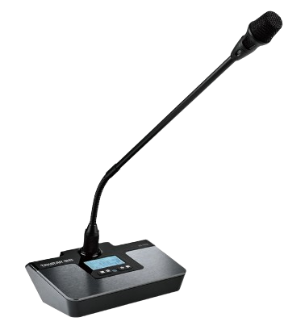
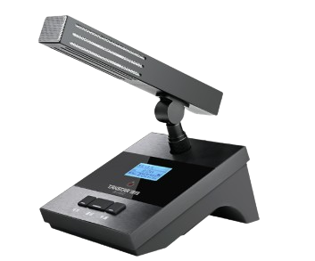
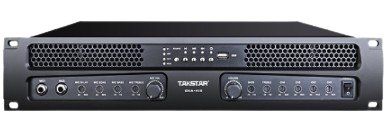
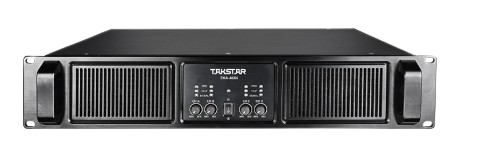
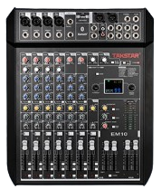
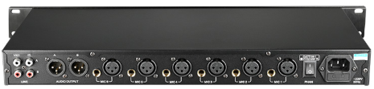
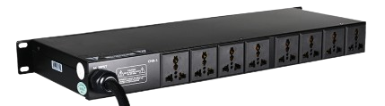

# 得胜

[toc]

| 产品名称                                                     | Category                                                     | Picture                                                      | 备注                                                         |
| ------------------------------------------------------------ | ------------------------------------------------------------ | ------------------------------------------------------------ | ------------------------------------------------------------ |
| [德胜 DG-U100无线麦克风系统](https://www.takstar.com/product/type/3677.html ) |                                                              |  | 60-70 米                                                     |
| [官网](https://www.takstar.com/product/type/3677.html)       |                                                              |    |                                                              |
| [官网](https://www.takstar.com/product/type/3677.html)       |                                                              |     |                                                              |
| [EKA-415 合并式四通道功放](https://www.takstar.com/product/type/3616.html) |                                                              |  | 4通道输出，每通道输出功率150W（8Ω)，可带负载4-8欧姆          |
| [EKA-403N 四通道专业功放 ](https://www.takstar.com/product/type/3539.html) |                                                              |  | [说明书](https://icn.takstar.com/upload/downloadFile/1589592219000.pdf) |
| [EBS-20C天花喇叭](https://www.takstar.com/product/type/3754.html) |                                                              |                                                              |                                                              |
| [1000W广播功放-EBS-100A](https://www.takstar.com/product/type/3652.html) |                                                              |                                                              |                                                              |
| [EKL-121 专业音箱](https://www.takstar.com/product/type/3574.html) |                                                              |  |                                                              |
| [Mixing Console-EM10](https://www.takstar.com/product/type/3985.html) [AM10](https://www.takstar.com/product/type/3634.html) |                                                              |  |                                                              |
| [音频处理器EKX-306](https://www.takstar.com/product/type/3325.html) |                                                              |            |                                                              |
| [FE-224N 抑制器](https://www.takstar.com/product/type/3763.html) FE-224N-Digital Feedback Suppressor |                                                              |  |                                                              |
| [路频率移位器](https://www.takstar.com/product/type/3486.html) [FE-601 Six CH Frequency Shifter](https://en.takstar.com/product/type/3237.html) | [User Manual(中文)](https://icn.takstar.com/upload/downloadFile/FE-601%E8%AF%B4%E6%98%8E%E4%B9%A6.pdf) |  |                                                              |
| [TS-808V 八路智能混音器](https://www.takstar.com/product/type/460.html) 8-Channel Intelligent Audio Mixer | [User Manual](https://icn.takstar.com/upload/downloadFile/20170205144359554.pdf) |  |                                                              |
| [G108 8-Channel Wireless Conference System](https://en.takstar.com/product/type/3327.html) | [User Manual](https://ien.takstar.com/upload/downloadFile/G108%E8%AF%B4%E6%98%8E%E4%B9%A6.pdf) |  | 100m transmission                                            |
| [OD200 Instrument Speaker](https://en.takstar.com/product/type/3489.html) | [User Manual](https://ien.takstar.com/upload/downloadFile/OD200%20Instrument%20Speaker%20User%20Manual.pdf) |            |                                                              |
| [EPO-802N 电源时序器](https://en.takstar.com/product/type/3232.html)  | [user manual](https://icn.takstar.com/upload/downloadFile/EPO-802N%E7%94%B5%E6%BA%90%E6%97%B6%E5%BA%8F%E5%99%A8%E8%AF%B4%E6%98%8E%E4%B9%A6.pdf) |  |                                                              |
| [EPO-802P电源时序器](https://www.takstar.com/product/type/3565.html) | [User Manual](https://icn.takstar.com/upload/downloadFile/EPO802P%E8%AF%B4%E6%98%8E%E4%B9%A6%20%E4%B8%AD%E6%96%87%E7%89%88.pdf) [EPO-802P中控指令表](https://icn.takstar.com/upload/downloadFile/EPO-802P%E4%B8%AD%E6%8E%A7%E6%8C%87%E4%BB%A4%E8%A1%A8.pdf) |                                                              | [802P](https://www.takstar.com/product/type/3565.html)可以级联 |

