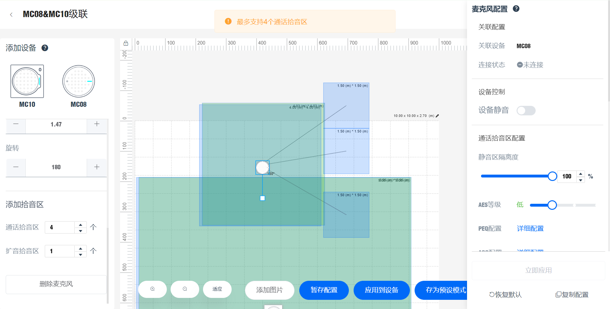

# 思必驰产品售前参考信息

[toc]

## 声音与拾音系统

 

### 1. 系统架构

本样板间采用**全Dante网络音频架构**，实现从拾音、处理到扩音的全数字化、低延迟传输。

| 模块       | 设备型号                           | 功能描述                                                     |
| ---------- | ---------------------------------- | ------------------------------------------------------------ |
| 拾音单元   | **Dante Ceiling Mic (M100)** ×2    | 吊顶式拾音与扩音一体化设备，内置Dante接口，支持全向拾音、语音增强和AEC回声消除。 |
| 扩声音箱   | **Dante Speaker (D20)** ×4         | 支持PoE供电，接收Dante音频信号，实现均匀扩声覆盖。           |
| 音频处理器 | **DP88 Dante Audio Processor**     | 提供音频信号混音、均衡、回声消除（AEC）及Dante音频分配功能。 |
| 音频接口   | **Dante Adapter / Audio Isolator** | 实现录播系统与NDP600之间音频隔离与数字接入。                 |

### 2. 信号流说明

- **拾音路径（上行）**
   教师及学生发言声音 → M100吊顶麦克风 → Dante网络 → DP88处理器 → LCS810录播系统（USB输入）及NDP600（Audio IN）。

  ```ABAP
  [教师/学生讲话]
        │  声音
        ▼
  [M100 Dante 吊顶麦]
        │  Dante (PoE)
        ▼
  [DP88 Dante 音频处理器]
        ├──► USB ──► [LCS810 录播主机 (USB Audio In)]
        └──► Dante ─► [M100 扬声端(扩声)]
        └──► Dante ─► [D20  扬声端(扩声)]
  ```

  

- **扩音路径（下行）**
   录播系统或NDP600音频输出 → Audio Isolator → DP88 → Dante网络 → D20扬声器。

  ```ABAP
  [录播系统 (LCS810) 或 NDP600 音频输出]
                 │  模拟音频信号 (Line Out)
                 ▼
  [Audio Isolator 音频隔离器]
                 │  消除地回路噪声，防止啸叫与干扰
                 ▼
  [DP88 Dante 音频处理器]
         ├──► Dante ─► [M100 扬声端 (扩声音箱)]
         │              ↑
         │              │ 主扩声设备，覆盖讲台及中心区域
         │
         └──► Dante (PoE) ─► [D20 Dante 扬声器 ×4]
                             ↑
                             │ 辅助扩声音箱，分布于教室四角
                             │ 提供均匀声场与补声效果
  ```

- **网络与供电**
   所有Dante设备通过**PoE交换机**统一供电与传输，确保系统稳定与同步。

### 3. 系统特性

1. **全数字Dante音频传输**：低延迟、高保真、抗干扰。
2. **拾音与扩音一体化**：M100具备内置拾音和扬声功能，减少施工布线。
3. **AEC与AGC算法**：有效抑制回声与啸叫，确保语音清晰。
4. **均匀声场覆盖**：4台D20扬声器实现教室全域声音覆盖。
5. **远程调校能力**：通过DP88网页界面可实时调整EQ、输入增益与输出通道分配。
6. **系统联动**：音频信号可同步供给录播与扩声，实现“所听即所录”。


## 1. 吸顶麦 M100

- 吸顶麦按照半径4米进行评估：
  - 3-5 | 5-8 ： 
    - **M40**: 拓音3米，拾音5米; 最多支持2个;
    - **M100**:  拓音5米，拾音8米； 没有限制接入个数[^1]
    - 可以用出厂配的吊丝安装， 安装在3-3.2米左右高度。 也可以用伸缩投影仪抓盘，高度相同。
  - 定义: 
    - **拾音**: 本地录制和给互动远端
    - **拓音**：是本地声音放大，从本地喇叭输出
  - Configurable Pickup Zones： 8 (4 PA pickup zones, 4 teleconference pickup)”的意思是：该设备或系统共有**8个可配置的拾音区域（pickup zones）**，其中：
    - 4个区域用于**PA（公共广播）拾音**，即用于拾取和扩声本地环境中的声音，让现场的声音能通过扩音系统播放；正常的拓音就是3米（最佳），有时候可能需要隔离掉一些区域，则这时候最多可以选择出4个区域，其他的区域则隔离掉不拾音（宋工，2025-7-15）
    - 另外4个区域用于**远程会议拾音（teleconference pickup）**，即专门用于拾取用于远程视频会议的音频信号，确保远程参与者能听到清晰的声音。
  
- 这个怎么理解呢 4个公共广播适应，4个远程会议拾音

   

  这个是拾音区最大数量

- 那一个教室内 怎么区分哪些是本地拾音 哪些是远程拾音呢 

   

  - 这个指的是拾音区最多的数量，每个拾音区都可以随意拉动

     

    - 这个可以根据配置页面的颜色来看


## 2. DP88/DP44 音频处理器

- DP88 需要接入:

  - 一根网线用于Dante通讯

  - 另一根网线用于配置调试，调试完毕可以撤掉

  - 一个**AIMIC**要占据<font color=red>**2个通道（拾音+拓音）**</font>，DP88有8个通道

     

    - 这边dsp通道不够了，可能要走模拟
    - 或者DSP的自带声卡

  - **注意DP88是地插供电，不使用PoE**

     

  - aa 

- 如果说采用都是M40/M100 以及DC20， 用户拿自己的笔记本去开会的话 要怎么获取到麦克风和喇叭呢 （这个是针对会议室场景 ）

  - 这个需要连接Dante 适配器，一般可以选择数字信号usb输出也有客户喜欢使用蓝牙的。
  - 比如我的笔记本 直接购买一个Dante 蓝牙就可以了吗 ?
    - 是的，在dante网络里配置就可以了

- DP88/44也可以直接接入笔记本吗 是走有线的吗

   

  - 自带usb声卡，可以这么走； 一根usb to usb线到笔记本
    - 自带USB声卡是指笔记本必须带 还是说DP88支持
      - dp88自带的声卡，即插即用


### 两台DP88

- M100没有上限，是不是就会面临DP88的通道不够用的情况，这个情况有什么解决办法呢
  - 通常可以使用俩台音频处理器DP88，分开处理扩声的声音和远程会议的声音。如果还是不够就需要使用通道更多的音频处理器

- M100使用的是dante协议，单台dp88最多支持4台M100；那如果想使用6台M100，可以使用两台DP88，本**地扩声和远程分开在不同的音频处理器上处理。**

case：

 

> 12.5 x 12.5 平：
>
> 房间面积太大了，如果要考虑到全场扩声覆盖还是需要4台吸顶麦克风。这样dp88需要两台, 关于配置有问题的话可以远程协助配置。DC20可以给出8台

- 8台喇叭4台麦克风。远程通道都交给另一台处理 那么可以是一台DP88, 一台44吗？
  - 答：**其实每一台都是4通道加一dante通道实际上每台要用5个通道，还是建议使用两台88**


## 3. DC20 喇叭

1. DC20可以大概覆盖范围：
   - DC20 覆盖角度是120°,  覆盖范围和安装高度有关系。 安装越高覆盖范围越大但是效果会衰减。 其次喇叭如果数量太少声场可能不均衡，有的地方声音大 有的地方声音小。 
   - 以3米层高为例，则：30个平方左右，人的坐姿情况下，耳朵距离天花板大概1.8米，按照60度的覆盖角，大概是3.11米的半径；

2. 那DC20也是走Dante，是不是也要占据一个通道？ 如果对于面积大一点的场地来说，一台DP88会很快出现通道耗尽，这时候要怎么解决呢
   - dc20它出的声音都是一样的，所以通常情况下所有的dc20使用一路信号，占用一个dante通道就可以

### 反听

| 设备   | 位置示意                                                     | 说明                                                      |
| ------ | ------------------------------------------------------------ | --------------------------------------------------------- |
| 吸顶麦 |  | 拾音范围：8米; 拓音5米<br />(大小：10.75m x 7.10m x 3.5m) |
| 喇叭   |  | 范围：大概3米<br />5个喇叭，多一个做老师的反听            |

 反听： 就是给老师声音同步扩出来的感觉，如果没有的话会让老师没感觉在扩声

-----

在国际音响行业或更规范的说法里，通常叫：

- **返送 (Monitor / Foldback / Stage Monitor)**
- 或者更具体一点叫 **教师返送音箱 (Teacher Monitor Speaker)** / **监听 (Monitor Speaker)**
- 在正式文件或方案里，建议用 **“返送音箱 (Monitor Speaker)”** 或 **“讲台返送（Podium Monitor Speaker）”**，这样更规范，也更容易让非业内人士理解。

所谓“反听”，其实就是指：把麦克风扩声后的声音再从一只音箱里返回给讲话人（老师），让他/她能感受到“自己的声音被扩出来”。

----

**为什么要有“反听”？**

- 如果没有反听，老师在讲课时可能会觉得“声音很小”，因为扩声主要是面向学生座位区。
- 返送给老师一点声音，可以增强讲话的“反馈感”，避免他/她越讲越大声、造成嗓音疲劳。
- 在舞台、会议、教室场景中，都是很常见的做法。

----

**术语：**

| 中文常用说法   | 正规/推荐说法       | 英文对应表达                       | 说明                                     |
| -------------- | ------------------- | ---------------------------------- | ---------------------------------------- |
| 反听（口语化） | 返送音箱 / 返送     | Monitor Speaker / Foldback Speaker | 国内业内口语，意思是“声音返送给讲者”     |
| 老师反听       | 教师返送音箱        | Teacher Monitor Speaker            | 教室场景，专门给教师听的返送声音         |
| 舞台反听       | 舞台返送            | Stage Monitor / Floor Monitor      | 舞台演出常用，地板斜放的监听音箱         |
| 监听（混用词） | 舞台监听 / 返送监听 | Monitor (generic)                  | 国内也常说“监听”，但容易和录音棚监听混淆 |
| 监听音箱       | 录音监听音箱        | Studio Monitor Speaker             | 录音棚/制作用的监听，和返送用途不同      |


## 4. Dante Adapter

https://apexpro.co.za/products/dante-avio/

我发现dante adapter都是USB或者是卡农口，没有 RCA（6.35mm)或者是LINE （3.55mm）转接口， 这是为什么？

 


之所以市面上的 **Dante Adapter（转接器）** 常见的只有 **USB** 或 **XLR（卡农口）**，而没有你提到的 **RCA（莲花口）**、**6.35mm TRS**、**3.5mm LINE接口**，原因主要有以下几点：

------

### 1. Dante 的应用定位不同

- **Dante 是专业音视频传输协议**，主要用于广播、扩声、会议、大型舞台等专业场景。
- 在这些场景里，常用的接口标准就是 **XLR（卡农口，平衡信号）** 和 **USB（数字接口）**。
- 而 **RCA、3.5mm、6.35mm** 这些接口更多见于消费级或半专业设备（比如音响、播放器、耳机、乐器等），不属于 Dante 的主要目标市场。

------

### 2. 信号传输可靠性

- **XLR/卡农口（平衡信号）**：抗干扰能力强，适合长距离传输，是专业音频标准。
- **RCA/3.5mm（非平衡信号）**：抗干扰能力差，长距离传输容易产生噪声和衰减，不符合 Dante 的高可靠性需求。
- 所以厂商更愿意只做 **平衡信号（XLR/6.35 TRS）** 或 **数字接口（USB/光纤）** 的 Dante Adapter。

------

### 3. 使用场景不同

- **RCA、3.5mm、6.35mm** 常用于乐器、播放器、消费电子。
- 这些设备如果要接 Dante 网络，通常不是直接用 Adapter，而是通过 **调音台（Mixer）** 或 **音频接口（Audio Interface）**，它们本身会提供 RCA/TRS/3.5mm 输入，再把信号转 Dante。
- 所以厂商不生产这种“小众”直接转接头，而是交由上游设备解决。

------

### 4. 产品设计和成本考虑

- 做 Dante Adapter 需要授权芯片（Audinate 的 Ultimo、Brooklyn II 等），成本较高。
- 如果做 RCA/3.5mm，定位就会变成“消费级”，但 Dante 本身定位是“专业级”，市场需求小，厂商不会花钱做。

------

✅ **总结**：
 Dante Adapter 只有 **USB 和 XLR**，是因为 **专业场景只需要这两类接口**。
 像 RCA/3.5mm 这种接口，若要上 Dante，一般会通过 **音频接口/调音台/处理器** 来间接转换，而不是用独立的 Dante Adapter。


### 5. Dante 接入常见方式对照表

| 接口类型                         | 常见场景                     | 是否有 Dante Adapter 直转                  | 常见接入方案                                              | 说明                                                         |
| -------------------------------- | ---------------------------- | ------------------------------------------ | --------------------------------------------------------- | ------------------------------------------------------------ |
| **USB**                          | 电脑、笔记本、多媒体播放器   | ✅ 有（Audinate Dante AVIO USB Adapter）    | 直接用 Dante USB Adapter 即可接入 Dante 网络              | 主要用于电脑音频输入/输出到 Dante 网络                       |
| **XLR（卡农口，平衡）**          | 麦克风、调音台、专业音响设备 | ✅ 有（Audinate Dante AVIO Analog Adapter） | 直接使用 Dante XLR Adapter                                | 专业音频标准接口，抗干扰强，Dante 的主流选择                 |
| **6.35mm TRS（大三芯/大二芯）**  | 乐器（吉他、键盘）、舞台设备 | ❌ 没有直转                                 | 通过 **音频接口 / 调音台**（带 Dante 模块）接入           | 因为 TRS 常用于乐器/舞台，通常先进调音台或 Audio Interface，再转 Dante |
| **RCA（莲花口，非平衡）**        | DVD、播放器、消费级音响设备  | ❌ 没有直转                                 | 使用 **音频处理器/调音台**，其 RCA 输入 → 内部 Dante 模块 | RCA 属于消费级接口，抗干扰差，不适合 Dante 直连              |
| **3.5mm（LINE/耳机口，非平衡）** | 手机、平板、笔记本耳机孔     | ❌ 没有直转                                 | 使用 **小型音频接口**（带 3.5mm 输入）→ Dante             | 适合临时接入，音质和稳定性较差                               |
| **光纤/同轴（SPDIF、AES/EBU）**  | 专业音频处理设备、数字播放器 | ⚠️ 少数有（部分 Dante 音频接口）            | 数字音频接口转换器（支持 SPDIF/AES/EBU）→ Dante           | 用于高保真数字音频接入                                       |

**要点总结**

1. **Dante 官方只提供 USB 和 XLR 转接器** → 满足大部分专业需求。
2. **RCA、3.5mm、6.35mm 等非平衡接口** → 通常通过 **调音台 / 音频接口 / 处理器** 来间接接入 Dante。
3. **专业场景核心原则**：优先用 **平衡接口（XLR/TRS）**，保证传输稳定性。
4. **消费级设备要接 Dante** → 必须先经过 **中间级设备**（调音台、音频接口）。


## 5. Dante 转盒

 

> **[Dante I/O接口机](https://www.cretone.cn/products/dante-adapter-box/16.html)**

> 此产品是一套模拟设备到DANTE数字网络的转换器，有Dante转模拟、模拟转Dante双向转换功能，以满足不同的转换需求。
> 4路模拟&4路Dante通道
> 每个通道带+48V幻象电源
>
> [User Manual](https://www.cretone.cn/files/pdf/%E8%AF%B4%E6%98%8E%E4%B9%A6/Dante%E6%8E%A5%E5%8F%A3%E6%9C%BA%E4%BD%BF%E7%94%A8%E8%AF%B4%E6%98%8E.pdf)


 **“DANTE转盒”**，常见的英文名称是：

**Dante Converter** 或 **Dante Interface**。

在专业音视频行业里，根据功能和接口不同，也会使用更具体的叫法：

- **Dante Audio Interface** （常见于“模拟 ↔ 数字/Dante”的转换）
- **Dante AD/DA Converter** （如果同时支持模拟输入输出，比如你图上的 AD44 = 4 输入 / 4 输出）
- **Dante Breakout Box** （非正式，但有时厂商/工程师习惯这样称呼）

 


## 6. VLAN

1. 这些设备到时候都是在一个局域网下，所有的房间信号都是网络里面跑 不知道 不知道会不会相互作用 
   - 要配到不同的vlan网上,多台交换机会导致dante时钟混乱

2. 必须vlan吗， 好像NDP本身不支持vlan
   - 画到不同网段就可以了,如果需要中控控制音频处理器可以做中继

3.  以这个房间为例， 是说可以把AIMIC，DC20划分在一个VLAN下面，然后NDP不做VLAN划分，但是可以正常调用到这些资源吗 

    

4. 另外每间教室划分Vlan,是不是每间教室都要再购买一台路由器呢？ 
   - 不需要，这个是交换机的功能，基础功能


## 7. PoE交换机

清单如下：

> 1.  Dante Ceiling Mic (M100) x 4
>
> 2.  Dante Speaker (DC20) x 8
> 3. Audio Processor DP88  x 2


- 交换机要16口，总功率300w poe+供电
- @石芽 对了宋工 PoE的 300W是怎么计算的 客户刚还说他们有一台250W的行不行 出于保险我还是建议说300W
  - 保险还是300w，喇叭30w，麦克风15w
  - 不开启节能模式，支持igmp snooping


### igmp snooping

> "不开启节能模式，支持igmp snooping"???

关键点：
 **“不开启节能模式（Green Ethernet / Energy Efficient Ethernet）” 和 “支持 IGMP Snooping”——100% 都是在说交换机（Switch），不是 Dante 设备。**

原因：

1. **Dante 产品根本没有“节能模式”这一说法**
    节能模式属于网管交换机的功能（EEE / Green Ethernet）。
    Dante 设备不会提供任何“节能模式”可供关闭。
2. **IGMP Snooping 是交换机的多播管理功能**
    与 Dante 的多播音频包相关，但设置是在交换机。
    Dante Controller 里面也可以管理多播流，但不会谈 “支持 IGMP Snooping”。

Dante 网络本身不涉及节能参数，但交换机如果开启 EEE 会导致多播/单播 packet 间歇性丢包，因此我们会统一关闭这一项。IGMP Snooping 会确保多播音频只分发到订阅端口，避免无关流量占满交换机。


### IGMP Snooping 是什么缩写？

1. **IGMP = Internet Group Management Protocol**
    互联网组管理协议，用来管理网络里的多播组（Multicast Group）。
2. **Snooping = “悄悄监听” / “窥探”**
    网络术语里的 Snooping 意思是：
    **交换机不主动参与协议，只是“偷听”经过的数据包，从中学习信息。**

所以完整意思是：

**IGMP Snooping = 交换机通过偷听 IGMP 包来判断哪些端口需要多播流，从而精准分发多播。**


### 为啥叫 Snooping？（关键点）

因为：

- IGMP 是主机与路由器之间的协议
- 交换机本来不参与 IGMP 协议
- 但为了节省多播流量，交换机会 **偷听（Snoop）** 这些消息
- 然后根据偷听到的内容决定：哪些端口要收多播，哪些不要

换句话说：

**交换机像偷窥者一样，偷偷听别人说话，然后做路由决定。**


### 旁路镜像（Port Mirroring） ≠ IGMP Snooping

**“旁路镜像（Port Mirroring） ≠ IGMP Snooping”，它们没有直接关系，也不能互相替代。**

下面我给你拆开解释，让你下次听到台湾同事讲也能立刻分辨。

------

1. IGMP Snooping 是干嘛的？

------

**用途：多播控制（Multicast Control）**

核心动作：
 交换机 **偷听**（snoop）IGMP 加入/退出组的消息，然后决定多播流应该发到哪些端口。

特点：

- 涉及多播（Multicast）
- 交换机在“偷听”IGMP协议
- 目的是节省带宽，避免全网泛洪

这是 **Dante 多播、视频多播** 的关键功能。

------

1. “旁路镜像（Port Mirroring）”又是啥？

------

台湾、日本、东南亚的网络工程师很常用这个词。

**用途：抓包、诊断、流量监控**

Port Mirroring（也叫 SPAN、镜像端口）是：

- 把某个端口的流量 **复制一份** 到另外一个端口
- 给抓包仪、Wireshark、网络探针使用
- 完全用于 **排查问题、监控网络**

特点：

- 不涉及多播
- 不涉及 IGMP
- 不节省流量，只是复制流量
- 和音视频协议无直接关系

一句话讲清楚：

**Port Mirroring 是“复制流量”。
 IGMP Snooping 是“控制多播”。**

------

2. 两者为什么会让你产生联想？

------

因为它们都和“观察流量”有关，但角色不同：

| 功能               | 目的                   | 交换机行为                 |
| ------------------ | ---------------------- | -------------------------- |
| **IGMP Snooping**  | 管理多播流量，避免泛洪 | 偷听 IGMP 包（不主动参与） |
| **Port Mirroring** | 抓包、分析、监控       | 复制流量到镜像端口         |

同样是“监听/观察”，但：

- Snooping 是网络控制功能
- Mirroring 是网络诊断功能

**本质不同。**

------

1. 总结：一句话让你永远不会搞混

------

你可以用我这句话记死：

**“Snooping 是偷听 IGMP 控制多播；
 Mirroring 是复制流量去抓包。”**


## Reference

1. https://chatgpt.com/g/g-p-6906e898fea48191a456216ddde382ae-qnex-shou-qian/c/692ebfd3-d9c4-8320-af56-aeddab8f2f6a


[^1]: 


### 报价信息

> pls pay attention to the unit price, my quote is based on per pcs

1.  Dante Ceiling Mic (M100) x 4pcs， EXW USD 3250/pcs
2. Dante Speaker (DC20) x 8pcs， EXW USD 330/pcs
3. Audio Processor DP88  x 2pcs, EXW USD 1500/pcs
4. PoE Switch  (At least 16 PoE ports with a total power of 300W) x1-no need.
5. Dante Adapter x 1pcs, EXW USD 260/pcs
6. LCS810 station x 1pcs, EXW USD 1650/pcs
7. CV870-S CAMERA x 1pcs, EXW USD 970/pcs
8. CV870-T CAMERA x 1pcs, EXW USD 970/pcs （optional for teacher camera）
all for 1-y warranty.